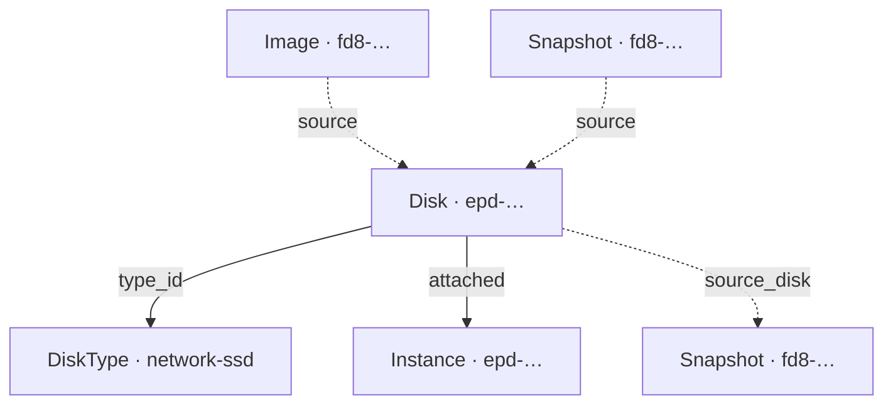

import { DICTIONARY } from '@site/src/constants/dictionary'
import { TYPES } from '@site/src/constants/types'
import { RESTRICTIONS } from '@site/src/constants/restrictions'
import { Restrictions } from '@site/src/components/commonBlocks/Restrictions'
import { Codes } from '@site/src/components/commonBlocks/Codes'
import { StatusTable } from '@site/src/components/commonBlocks/StatusTable'
import { ApiOperation } from '@site/src/components/commonBlocks/ApiOperation'
import CodeBlock from '@theme/CodeBlock'
import dedent from 'ts-dedent'

# Disk

**Disk** — блочное хранилище для виртуальной машины: том фиксированного размера в конкретной
зоне доступности, который присоединяется к инстансу как загрузочный или дополнительный диск.
Вы заводите `Disk`, когда инстансу нужно постоянное хранилище — под операционную систему
(загрузочный диск) или под данные приложения (диск данных), которое переживает пересоздание
инстанса.

Диск можно создать пустым (только размер) либо из **источника** — образа (`imageId`) или
снимка (`snapshotId`); источник фиксируется при создании и неизменяем. Тип диска (`typeId`)
задаёт класс хранилища из справочника [DiskType](/api/disk-type), а зона (`zoneId`) —
размещение: диск присоединяется только к инстансу той же зоны.

:::info Идентификатор и владелец
ID диска — префикс `epd` + 17 символов crockford-base32 (например, `epd0am5d8q1w4e7r2t6y`;
префикс общий с Instance). Диск принадлежит проекту `kacho-iam` (`projectId`, immutable) и
зоне `kacho-geo` (`zoneId`, immutable).
:::

## Поля ресурса

<table>
  <thead><tr><th>Поле</th><th>Тип</th><th>Описание</th></tr></thead>
  <tbody>
    <tr><td><code>id</code></td><td><code>{TYPES.string}</code></td><td>{DICTIONARY.id.short}</td></tr>
    <tr><td><code>projectId</code></td><td><code>{TYPES.string}</code></td><td>{DICTIONARY.projectId.short}</td></tr>
    <tr><td><code>name</code></td><td><code>{TYPES.string}</code></td><td>{DICTIONARY.name.short}</td></tr>
    <tr><td><code>description</code></td><td><code>{TYPES.string}</code></td><td>{DICTIONARY.description.short}</td></tr>
    <tr><td><code>labels</code></td><td><code>{TYPES.mapStringString}</code></td><td>{DICTIONARY.labels.short}</td></tr>
    <tr><td><code>createdAt</code></td><td><code>{TYPES.timestamp}</code></td><td>{DICTIONARY.createdAt.short}</td></tr>
    <tr><td><code>typeId</code></td><td><code>{TYPES.string}</code></td><td>{DICTIONARY.typeId.short} (immutable)</td></tr>
    <tr><td><code>zoneId</code></td><td><code>{TYPES.string}</code></td><td>{DICTIONARY.zoneId.short}</td></tr>
    <tr><td><code>size</code></td><td><code>{TYPES.int64}</code></td><td>{DICTIONARY.diskSize.short}</td></tr>
    <tr><td><code>blockSize</code></td><td><code>{TYPES.int64}</code></td><td>{DICTIONARY.blockSize.short}</td></tr>
    <tr><td><code>status</code></td><td><code>{TYPES.status}</code></td><td>{DICTIONARY.status.short}</td></tr>
    <tr><td><code>sourceImageId</code> / <code>sourceSnapshotId</code></td><td><code>{TYPES.string}</code></td><td>{DICTIONARY.diskSource.short}</td></tr>
    <tr><td><code>instanceIds</code></td><td><code>{TYPES.repeatedString}</code></td><td>{DICTIONARY.instanceIds.short}</td></tr>
  </tbody>
</table>

### Статусы

<StatusTable values={[
  { code: 'CREATING', desc: 'Диск создаётся' },
  { code: 'READY', desc: 'Диск готов к использованию (в control-plane выставляется сразу после Create)' },
  { code: 'ERROR', desc: 'Диск в ошибочном состоянии' },
  { code: 'DELETING', desc: 'Диск удаляется' },
]} />

---

## Get

<ApiOperation method="GET" endpoint="/compute/v1/disks/{diskId}">

Возвращает диск по идентификатору.

#### Пример запроса

<CodeBlock language="bash">
  {dedent`
    curl http://localhost:18080/compute/v1/disks/{diskId} \\
      -H 'Authorization: Bearer <JWT>'
  `}
</CodeBlock>

#### Пример ответа

<CodeBlock language="json">
  {dedent`
    {
      "id": "{diskId}",
      "projectId": "{projectId}",
      "name": "data-disk",
      "typeId": "network-ssd",
      "zoneId": "region-1-a",
      "size": "8589934592",
      "blockSize": "4096",
      "status": "READY",
      "instanceIds": [],
      "createdAt": "2026-06-06T14:27:00Z"
    }
  `}
</CodeBlock>

<Codes codes={['invalidArgument', 'notFound', 'permissionDenied', 'internal']} />

</ApiOperation>

---

## List

<ApiOperation method="GET" endpoint="/compute/v1/disks">

Список дисков проекта с фильтром и cursor-пагинацией.

#### Параметры запроса

<table>
  <thead><tr><th>Параметр</th><th>Обязательность</th><th>Тип</th><th>Описание</th></tr></thead>
  <tbody>
    <tr><td><code>projectId</code></td><td><strong>да</strong></td><td><code>{TYPES.string}</code></td><td>{DICTIONARY.projectId.short}</td></tr>
    <tr><td><code>filter</code></td><td>нет</td><td><code>{TYPES.string}</code></td><td>{DICTIONARY.filter.short}</td></tr>
    <tr><td><code>orderBy</code></td><td>нет</td><td><code>{TYPES.string}</code></td><td>Сортировка, напр. <code>createdAt desc</code> (по умолчанию <code>id asc</code>)</td></tr>
    <tr><td><code>pageSize</code></td><td>нет</td><td><code>{TYPES.int64}</code></td><td>{DICTIONARY.pageSize.short}</td></tr>
    <tr><td><code>pageToken</code></td><td>нет</td><td><code>{TYPES.string}</code></td><td>{DICTIONARY.pageToken.short}</td></tr>
  </tbody>
</table>

#### Пример запроса

<CodeBlock language="bash">
  {dedent`
    curl 'http://localhost:18080/compute/v1/disks?projectId={projectId}&pageSize=50' \\
      -H 'Authorization: Bearer <JWT>'
  `}
</CodeBlock>

#### Пример ответа

<CodeBlock language="json">
  {dedent`
    {
      "disks": [
        { "id": "{diskId}", "projectId": "{projectId}", "name": "data-disk", "typeId": "network-ssd", "zoneId": "region-1-a", "size": "8589934592", "status": "READY" }
      ],
      "nextPageToken": ""
    }
  `}
</CodeBlock>

<Restrictions items={[{ label: 'pagination', rules: RESTRICTIONS.pagination }]} />
<Codes codes={['invalidArgument', 'permissionDenied', 'internal']} />

</ApiOperation>

---

## Create

<ApiOperation method="POST" endpoint="/compute/v1/disks" async>

Создаёт диск. Возвращает `Operation` (async). Если задан источник (`imageId` / `snapshotId`),
worker проверяет его существование; диск создаётся сразу в статусе `READY`.

#### Тело запроса

<table>
  <thead><tr><th>Параметр</th><th>Обязательность</th><th>Тип</th><th>Описание</th></tr></thead>
  <tbody>
    <tr><td><code>projectId</code></td><td><strong>да</strong></td><td><code>{TYPES.string}</code></td><td>{DICTIONARY.projectId.short}</td></tr>
    <tr><td><code>zoneId</code></td><td><strong>да</strong></td><td><code>{TYPES.string}</code></td><td>{DICTIONARY.zoneId.short}</td></tr>
    <tr><td><code>size</code></td><td><strong>да</strong></td><td><code>{TYPES.int64}</code></td><td>{DICTIONARY.diskSize.short}</td></tr>
    <tr><td><code>typeId</code></td><td>нет</td><td><code>{TYPES.string}</code></td><td>{DICTIONARY.typeId.short}</td></tr>
    <tr><td><code>name</code></td><td>нет</td><td><code>{TYPES.string}</code></td><td>{DICTIONARY.name.short}</td></tr>
    <tr><td><code>description</code></td><td>нет</td><td><code>{TYPES.string}</code></td><td>{DICTIONARY.description.short}</td></tr>
    <tr><td><code>labels</code></td><td>нет</td><td><code>{TYPES.mapStringString}</code></td><td>{DICTIONARY.labels.short}</td></tr>
    <tr><td><code>imageId</code> / <code>snapshotId</code></td><td>нет</td><td><code>{TYPES.string}</code></td><td>{DICTIONARY.diskSource.short}</td></tr>
    <tr><td><code>blockSize</code></td><td>нет</td><td><code>{TYPES.int64}</code></td><td>{DICTIONARY.blockSize.short}</td></tr>
  </tbody>
</table>

#### Пример запроса

<CodeBlock language="bash">
  {dedent`
    curl -X POST http://localhost:18080/compute/v1/disks \\
      -H 'Authorization: Bearer <JWT>' \\
      -H 'Content-Type: application/json' \\
      -d '{
        "projectId": "{projectId}",
        "name": "data-disk",
        "typeId": "network-ssd",
        "zoneId": "region-1-a",
        "size": 8589934592
      }'
  `}
</CodeBlock>

#### Пример ответа (Operation)

<CodeBlock language="json">
  {dedent`
    {
      "id": "{operationId}",
      "description": "Create disk data-disk",
      "done": false,
      "metadata": {
        "@type": "type.googleapis.com/kacho.cloud.compute.v1.CreateDiskMetadata",
        "diskId": "{diskId}"
      }
    }
  `}
</CodeBlock>

<Restrictions items={[
  { label: 'projectId', rules: RESTRICTIONS.projectId },
  { label: 'zoneId', rules: RESTRICTIONS.zoneId },
  { label: 'size', rules: RESTRICTIONS.diskSize },
  { label: 'name', rules: RESTRICTIONS.name },
  { label: 'blockSize', rules: RESTRICTIONS.blockSize },
]} />
<Codes codes={['invalidArgument', 'alreadyExists', 'notFound', 'unavailable', 'permissionDenied', 'internal']} />

</ApiOperation>

---

## Update

<ApiOperation method="PATCH" endpoint="/compute/v1/disks/{diskId}" async>

Изменяет mutable-поля диска (`name`, `description`, `labels`, `size`). `size` можно только
**увеличивать**. Поля `typeId` / `zoneId` / `blockSize` / `source` — immutable.

#### Тело запроса

<table>
  <thead><tr><th>Параметр</th><th>Обязательность</th><th>Тип</th><th>Описание</th></tr></thead>
  <tbody>
    <tr><td><code>updateMask</code></td><td>нет</td><td><code>{TYPES.fieldMask}</code></td><td>{DICTIONARY.updateMask.short}</td></tr>
    <tr><td><code>name</code></td><td>нет</td><td><code>{TYPES.string}</code></td><td>{DICTIONARY.name.short}</td></tr>
    <tr><td><code>description</code></td><td>нет</td><td><code>{TYPES.string}</code></td><td>{DICTIONARY.description.short}</td></tr>
    <tr><td><code>labels</code></td><td>нет</td><td><code>{TYPES.mapStringString}</code></td><td>{DICTIONARY.labels.short}</td></tr>
    <tr><td><code>size</code></td><td>нет</td><td><code>{TYPES.int64}</code></td><td>Новый размер (только увеличение; верхний предел Update — 4 TiB)</td></tr>
  </tbody>
</table>

#### Пример запроса

<CodeBlock language="bash">
  {dedent`
    curl -X PATCH http://localhost:18080/compute/v1/disks/{diskId} \\
      -H 'Authorization: Bearer <JWT>' \\
      -H 'Content-Type: application/json' \\
      -d '{
        "updateMask": "size",
        "size": 17179869184
      }'
  `}
</CodeBlock>

<Restrictions items={[
  { label: 'updateMask', rules: RESTRICTIONS.updateMask },
  { label: 'size', rules: RESTRICTIONS.diskSize },
]} />
<Codes codes={['invalidArgument', 'notFound', 'permissionDenied', 'internal']} />

</ApiOperation>

---

## Delete

<ApiOperation method="DELETE" endpoint="/compute/v1/disks/{diskId}" async>

Удаляет диск (hard-delete). **Присоединённый к инстансу диск удалить нельзя** —
`FAILED_PRECONDITION "The disk is being used"` (FK `attached_disks` `ON DELETE RESTRICT`).
Сначала отсоедините диск (`DetachDisk`) или удалите инстанс.

#### Пример запроса

<CodeBlock language="bash">
  {dedent`
    curl -X DELETE http://localhost:18080/compute/v1/disks/{diskId} \\
      -H 'Authorization: Bearer <JWT>'
  `}
</CodeBlock>

#### Пример ответа (Operation, response = Empty)

<CodeBlock language="json">
  {dedent`
    {
      "id": "{operationId}",
      "description": "Delete disk {diskId}",
      "done": false,
      "metadata": { "@type": "type.googleapis.com/kacho.cloud.compute.v1.DeleteDiskMetadata", "diskId": "{diskId}" }
    }
  `}
</CodeBlock>

<Codes codes={['invalidArgument', 'notFound', 'failedPrecondition', 'permissionDenied', 'internal']} />

</ApiOperation>

---

## ListOperations

<ApiOperation method="GET" endpoint="/compute/v1/disks/{diskId}/operations">

Список асинхронных операций над указанным диском с cursor-пагинацией.

#### Пример запроса

<CodeBlock language="bash">
  {dedent`
    curl http://localhost:18080/compute/v1/disks/{diskId}/operations \\
      -H 'Authorization: Bearer <JWT>'
  `}
</CodeBlock>

<Restrictions items={[{ label: 'pagination', rules: RESTRICTIONS.pagination }]} />
<Codes codes={['invalidArgument', 'notFound', 'permissionDenied', 'internal']} />

</ApiOperation>

---

## Сценарии использования

- **Загрузочный диск из образа.** Передайте `imageId` в `source` при создании — получите
  готовый к загрузке диск, который затем используется как `bootDiskSpec` инстанса.
- **Диск данных.** Пустой диск (без источника) под данные приложения; присоединяется к
  инстансу действием `AttachDisk` и переживает пересоздание ВМ (при `autoDelete=false`).
- **Восстановление из снимка.** Передайте `snapshotId` в `source` — диск создаётся с данными
  на момент снимка.
- **Расширение хранилища.** `Update` c `size` увеличивает диск без пересоздания (только вверх).

## Подводные камни

:::caution Удаление присоединённого диска
Пока диск числится в `instanceIds` (есть строка в `attached_disks`), `Delete` отклоняется с
`FAILED_PRECONDITION "The disk is being used"`. Отсоедините диск (`DetachDisk`) или удалите
инстанс — `Instance.Delete` сам решает судьбу дисков по флагу `autoDelete`.
:::

:::note Immutable-поля и размер
`typeId`, `zoneId`, `blockSize` и источник (`sourceImageId` / `sourceSnapshotId`) фиксируются
при `Create` и не меняются. `size` можно только увеличивать, причём верхний предел в `Update`
(4 TiB) ниже, чем в `Create` (~26 TiB) — планируйте начальный размер осознанно.
:::

:::note Источник — не FK
Диск хранит id образа/снимка, из которого создан, но жёсткого FK через границу нет: источник
можно удалить, диск продолжит существовать со ссылкой на уже несуществующий ресурс.
:::
