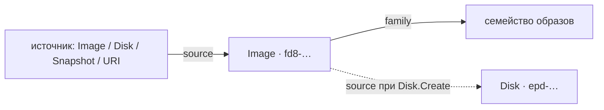

import { DICTIONARY } from '@site/src/constants/dictionary'
import { TYPES } from '@site/src/constants/types'
import { RESTRICTIONS } from '@site/src/constants/restrictions'
import { Restrictions } from '@site/src/components/commonBlocks/Restrictions'
import { Codes } from '@site/src/components/commonBlocks/Codes'
import { StatusTable } from '@site/src/components/commonBlocks/StatusTable'
import { ApiOperation } from '@site/src/components/commonBlocks/ApiOperation'
import CodeBlock from '@theme/CodeBlock'
import dedent from 'ts-dedent'

# Image

**Image** — переиспользуемый шаблон для создания загрузочных дисков: «слепок» операционной
системы и предустановленного ПО, из которого одинаковым образом разворачиваются диски и
инстансы. Вы заводите `Image`, когда хотите зафиксировать состояние диска как эталон
(«золотой образ») и потом раскатывать его на новые виртуальные машины — воспроизводимо и без
ручной настройки.

Образ создаётся из одного **источника** (ровно один из): другого образа (`imageId`), диска
(`diskId`), снимка (`snapshotId`) или внешнего URI (`uri`). Образы объединяются в **семейства**
(`family`): по имени семейства можно запросить самый свежий образ (`GetLatestByFamily`) — так
инстансы всегда создаются из актуальной версии эталона, без явного указания конкретного id.

:::info Идентификатор и владелец
ID образа — префикс `fd8` + 17 символов crockford-base32 (например, `fd83v5x7z9b1d4f6h8j0`;
префикс общий с Snapshot). Образ принадлежит проекту `kacho-iam` (`projectId`, immutable).
Образ не привязан к зоне — он доступен для создания дисков в любой зоне.
:::

## Поля ресурса

<table>
  <thead><tr><th>Поле</th><th>Тип</th><th>Описание</th></tr></thead>
  <tbody>
    <tr><td><code>id</code></td><td><code>{TYPES.string}</code></td><td>{DICTIONARY.id.short}</td></tr>
    <tr><td><code>projectId</code></td><td><code>{TYPES.string}</code></td><td>{DICTIONARY.projectId.short}</td></tr>
    <tr><td><code>name</code></td><td><code>{TYPES.string}</code></td><td>{DICTIONARY.name.short}</td></tr>
    <tr><td><code>description</code></td><td><code>{TYPES.string}</code></td><td>{DICTIONARY.description.short}</td></tr>
    <tr><td><code>labels</code></td><td><code>{TYPES.mapStringString}</code></td><td>{DICTIONARY.labels.short}</td></tr>
    <tr><td><code>createdAt</code></td><td><code>{TYPES.timestamp}</code></td><td>{DICTIONARY.createdAt.short}</td></tr>
    <tr><td><code>family</code></td><td><code>{TYPES.string}</code></td><td>{DICTIONARY.family.short}</td></tr>
    <tr><td><code>minDiskSize</code></td><td><code>{TYPES.int64}</code></td><td>{DICTIONARY.minDiskSize.short}</td></tr>
    <tr><td><code>storageSize</code></td><td><code>{TYPES.int64}</code></td><td>{DICTIONARY.storageSize.short}</td></tr>
    <tr><td><code>os</code></td><td><code>Os</code></td><td>{DICTIONARY.os.short}</td></tr>
    <tr><td><code>pooled</code></td><td><code>{TYPES.bool}</code></td><td>Признак пула для быстрого создания дисков (immutable)</td></tr>
    <tr><td><code>status</code></td><td><code>{TYPES.status}</code></td><td>{DICTIONARY.status.short}</td></tr>
  </tbody>
</table>

### Статусы

<StatusTable values={[
  { code: 'CREATING', desc: 'Образ создаётся' },
  { code: 'READY', desc: 'Образ готов к использованию (в control-plane «загрузка» мгновенна → сразу READY)' },
  { code: 'ERROR', desc: 'Образ в ошибочном состоянии' },
  { code: 'DELETING', desc: 'Образ удаляется' },
]} />

---

## Get

<ApiOperation method="GET" endpoint="/compute/v1/images/{imageId}">

Возвращает образ по идентификатору.

#### Пример запроса

<CodeBlock language="bash">
  {dedent`
    curl http://localhost:18080/compute/v1/images/{imageId} \\
      -H 'Authorization: Bearer <JWT>'
  `}
</CodeBlock>

#### Пример ответа

<CodeBlock language="json">
  {dedent`
    {
      "id": "{imageId}",
      "projectId": "{projectId}",
      "name": "app-base",
      "family": "app",
      "minDiskSize": "10737418240",
      "storageSize": "3221225472",
      "os": { "type": "LINUX" },
      "status": "READY",
      "createdAt": "2026-06-06T14:27:00Z"
    }
  `}
</CodeBlock>

<Codes codes={['invalidArgument', 'notFound', 'permissionDenied', 'internal']} />

</ApiOperation>

---

## GetLatestByFamily

<ApiOperation method="GET" endpoint="/compute/v1/images:latestByFamily">

Возвращает самый свежий (по времени создания) образ указанного семейства в проекте. Удобно
для создания инстансов из «актуальной версии» эталона без явного id.

#### Параметры запроса

<table>
  <thead><tr><th>Параметр</th><th>Обязательность</th><th>Тип</th><th>Описание</th></tr></thead>
  <tbody>
    <tr><td><code>projectId</code></td><td><strong>да</strong></td><td><code>{TYPES.string}</code></td><td>{DICTIONARY.projectId.short}</td></tr>
    <tr><td><code>family</code></td><td><strong>да</strong></td><td><code>{TYPES.string}</code></td><td>{DICTIONARY.family.short}</td></tr>
  </tbody>
</table>

#### Пример запроса

<CodeBlock language="bash">
  {dedent`
    curl 'http://localhost:18080/compute/v1/images:latestByFamily?projectId={projectId}&family=app' \\
      -H 'Authorization: Bearer <JWT>'
  `}
</CodeBlock>

<Codes codes={['invalidArgument', 'notFound', 'permissionDenied', 'internal']} />

</ApiOperation>

---

## List

<ApiOperation method="GET" endpoint="/compute/v1/images">

Список образов проекта с фильтром и cursor-пагинацией.

#### Параметры запроса

<table>
  <thead><tr><th>Параметр</th><th>Обязательность</th><th>Тип</th><th>Описание</th></tr></thead>
  <tbody>
    <tr><td><code>projectId</code></td><td><strong>да</strong></td><td><code>{TYPES.string}</code></td><td>{DICTIONARY.projectId.short}</td></tr>
    <tr><td><code>filter</code></td><td>нет</td><td><code>{TYPES.string}</code></td><td>{DICTIONARY.filter.short}</td></tr>
    <tr><td><code>pageSize</code></td><td>нет</td><td><code>{TYPES.int64}</code></td><td>{DICTIONARY.pageSize.short}</td></tr>
    <tr><td><code>pageToken</code></td><td>нет</td><td><code>{TYPES.string}</code></td><td>{DICTIONARY.pageToken.short}</td></tr>
  </tbody>
</table>

#### Пример ответа

<CodeBlock language="json">
  {dedent`
    {
      "images": [
        { "id": "{imageId}", "projectId": "{projectId}", "name": "app-base", "family": "app", "status": "READY" }
      ],
      "nextPageToken": ""
    }
  `}
</CodeBlock>

<Restrictions items={[{ label: 'pagination', rules: RESTRICTIONS.pagination }]} />
<Codes codes={['invalidArgument', 'permissionDenied', 'internal']} />

</ApiOperation>

---

## Create

<ApiOperation method="POST" endpoint="/compute/v1/images" async>

Создаёт образ из источника. Возвращает `Operation` (async). Тело несёт **ровно один** вариант
`source` (`imageId` | `diskId` | `snapshotId` | `uri`); worker проверяет существование
источника. «Загрузка» в control-plane мгновенна — образ сразу переходит в `READY`.

#### Тело запроса

<table>
  <thead><tr><th>Параметр</th><th>Обязательность</th><th>Тип</th><th>Описание</th></tr></thead>
  <tbody>
    <tr><td><code>projectId</code></td><td><strong>да</strong></td><td><code>{TYPES.string}</code></td><td>{DICTIONARY.projectId.short}</td></tr>
    <tr><td><code>imageId</code> / <code>diskId</code> / <code>snapshotId</code> / <code>uri</code></td><td><strong>да (ровно один)</strong></td><td><code>{TYPES.string}</code></td><td>{DICTIONARY.imageSource.short}</td></tr>
    <tr><td><code>name</code></td><td>нет</td><td><code>{TYPES.string}</code></td><td>{DICTIONARY.name.short}</td></tr>
    <tr><td><code>description</code></td><td>нет</td><td><code>{TYPES.string}</code></td><td>{DICTIONARY.description.short}</td></tr>
    <tr><td><code>labels</code></td><td>нет</td><td><code>{TYPES.mapStringString}</code></td><td>{DICTIONARY.labels.short}</td></tr>
    <tr><td><code>family</code></td><td>нет</td><td><code>{TYPES.string}</code></td><td>{DICTIONARY.family.short}</td></tr>
    <tr><td><code>minDiskSize</code></td><td>нет</td><td><code>{TYPES.int64}</code></td><td>{DICTIONARY.minDiskSize.short}</td></tr>
    <tr><td><code>os</code></td><td>нет</td><td><code>Os</code></td><td>{DICTIONARY.os.short}</td></tr>
  </tbody>
</table>

#### Пример запроса

<CodeBlock language="bash">
  {dedent`
    curl -X POST http://localhost:18080/compute/v1/images \\
      -H 'Authorization: Bearer <JWT>' \\
      -H 'Content-Type: application/json' \\
      -d '{
        "projectId": "{projectId}",
        "name": "app-base",
        "family": "app",
        "diskId": "{diskId}",
        "os": { "type": "LINUX" }
      }'
  `}
</CodeBlock>

#### Пример ответа (Operation)

<CodeBlock language="json">
  {dedent`
    {
      "id": "{operationId}",
      "description": "Create image app-base",
      "done": false,
      "metadata": {
        "@type": "type.googleapis.com/kacho.cloud.compute.v1.CreateImageMetadata",
        "imageId": "{imageId}"
      }
    }
  `}
</CodeBlock>

<Restrictions items={[
  { label: 'projectId', rules: RESTRICTIONS.projectId },
  { label: 'name', rules: RESTRICTIONS.name },
  { label: 'labels', rules: RESTRICTIONS.labels },
]} />
<Codes codes={['invalidArgument', 'alreadyExists', 'notFound', 'unavailable', 'permissionDenied', 'internal']} />

</ApiOperation>

---

## Update

<ApiOperation method="PATCH" endpoint="/compute/v1/images/{imageId}" async>

Изменяет mutable-поля образа (`name`, `description`, `labels`). Поля `family`, `minDiskSize`,
`os`, `productIds`, `pooled` — immutable.

#### Пример запроса

<CodeBlock language="bash">
  {dedent`
    curl -X PATCH http://localhost:18080/compute/v1/images/{imageId} \\
      -H 'Authorization: Bearer <JWT>' \\
      -H 'Content-Type: application/json' \\
      -d '{ "updateMask": "description", "description": "Базовый образ приложения" }'
  `}
</CodeBlock>

<Restrictions items={[{ label: 'updateMask', rules: RESTRICTIONS.updateMask }]} />
<Codes codes={['invalidArgument', 'notFound', 'permissionDenied', 'internal']} />

</ApiOperation>

---

## Delete

<ApiOperation method="DELETE" endpoint="/compute/v1/images/{imageId}" async>

Удаляет образ (hard-delete). Диски, созданные из этого образа, **не блокируют** удаление:
диск хранит id источника, но жёсткого FK через границу нет.

#### Пример запроса

<CodeBlock language="bash">
  {dedent`
    curl -X DELETE http://localhost:18080/compute/v1/images/{imageId} \\
      -H 'Authorization: Bearer <JWT>'
  `}
</CodeBlock>

<Codes codes={['invalidArgument', 'notFound', 'permissionDenied', 'internal']} />

</ApiOperation>

---

## ListOperations

<ApiOperation method="GET" endpoint="/compute/v1/images/{imageId}/operations">

Список асинхронных операций над указанным образом с cursor-пагинацией.

<Restrictions items={[{ label: 'pagination', rules: RESTRICTIONS.pagination }]} />
<Codes codes={['invalidArgument', 'notFound', 'permissionDenied', 'internal']} />

</ApiOperation>

---

## Сценарии использования

- **Золотой образ.** Настройте эталонный диск, снимите с него образ (`diskId`) — и
  разворачивайте инстансы из него воспроизводимо.
- **Версионирование через семейства.** Публикуйте новые версии в одно `family`; инстансы,
  создаваемые через `GetLatestByFamily`, всегда получают свежую версию без правки id.
- **Импорт извне.** Создайте образ из внешнего `uri` (pre-signed URL) — удобно для переноса
  готовых образов в проект.

## Подводные камни

:::caution Источник — ровно один
Тело `Create` обязано содержать **ровно один** из `imageId` / `diskId` / `snapshotId` / `uri`
(`oneof source`, `exactly_one`). Ноль или больше одного → `INVALID_ARGUMENT`.
:::

:::note Immutable-поля
`family`, `minDiskSize`, `os`, `productIds`, `pooled` фиксируются при `Create`. Меняются только
`name`, `description`, `labels`. Нужна другая версия семейства — создайте **новый** образ с тем
же `family`.
:::
