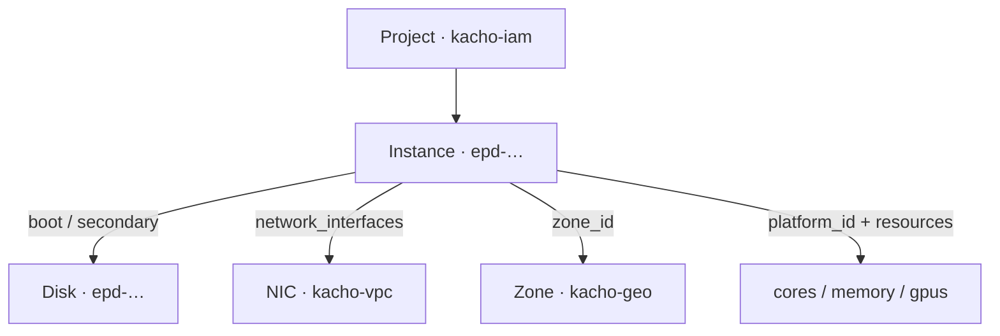

import { DICTIONARY } from '@site/src/constants/dictionary'
import { TYPES } from '@site/src/constants/types'
import { RESTRICTIONS } from '@site/src/constants/restrictions'
import { Restrictions } from '@site/src/components/commonBlocks/Restrictions'
import { Codes } from '@site/src/components/commonBlocks/Codes'
import { StatusTable } from '@site/src/components/commonBlocks/StatusTable'
import { ApiOperation } from '@site/src/components/commonBlocks/ApiOperation'
import CodeBlock from '@theme/CodeBlock'
import dedent from 'ts-dedent'

# Instance

**Instance** — виртуальная машина: основная вычислительная единица платформы. Вы заводите
`Instance`, когда приложению нужны процессорные ядра, память и диски, работающие как единый
управляемый ресурс с понятным жизненным циклом (создан → запущен → остановлен → удалён).

Инстанс собирается из нескольких частей: **платформы** (`platformId`) и **ресурсов**
(`resourcesSpec`: cores/memory/coreFraction/gpus), **загрузочного диска** (`bootDiskSpec` —
inline-спека или ссылка на существующий диск), дополнительных дисков и сетевых интерфейсов.
Инстанс привязан к зоне (`zoneId`) и проекту (`projectId`), а его состояние управляется
детерминированной **state-машиной** с явными предусловиями переходов.

:::info Идентификатор и владелец
ID инстанса — префикс `epd` + 17 символов crockford-base32 (например, `epd7t4w9e2x5h8mz0c3v`;
префикс общий с Disk). Инстанс принадлежит проекту `kacho-iam` (`projectId`, immutable) и зоне
`kacho-geo` (`zoneId`, immutable — меняется только через Relocate).
:::

## Поля ресурса

<table>
  <thead><tr><th>Поле</th><th>Тип</th><th>Описание</th></tr></thead>
  <tbody>
    <tr><td><code>id</code></td><td><code>{TYPES.string}</code></td><td>{DICTIONARY.id.short}</td></tr>
    <tr><td><code>projectId</code></td><td><code>{TYPES.string}</code></td><td>{DICTIONARY.projectId.short}</td></tr>
    <tr><td><code>name</code></td><td><code>{TYPES.string}</code></td><td>{DICTIONARY.name.short}</td></tr>
    <tr><td><code>description</code></td><td><code>{TYPES.string}</code></td><td>{DICTIONARY.description.short}</td></tr>
    <tr><td><code>labels</code></td><td><code>{TYPES.mapStringString}</code></td><td>{DICTIONARY.labels.short}</td></tr>
    <tr><td><code>createdAt</code></td><td><code>{TYPES.timestamp}</code></td><td>{DICTIONARY.createdAt.short}</td></tr>
    <tr><td><code>zoneId</code></td><td><code>{TYPES.string}</code></td><td>{DICTIONARY.zoneId.short}</td></tr>
    <tr><td><code>platformId</code></td><td><code>{TYPES.string}</code></td><td>{DICTIONARY.platformId.short}</td></tr>
    <tr><td><code>resources</code></td><td><code>Resources</code></td><td>{DICTIONARY.resources.short}</td></tr>
    <tr><td><code>status</code></td><td><code>{TYPES.status}</code></td><td>{DICTIONARY.status.short}</td></tr>
    <tr><td><code>metadata</code></td><td><code>{TYPES.mapStringString}</code></td><td>{DICTIONARY.metadata.short}</td></tr>
    <tr><td><code>bootDisk</code></td><td><code>AttachedDisk</code></td><td>{DICTIONARY.bootDisk.short}</td></tr>
    <tr><td><code>secondaryDisks</code></td><td><code>repeated AttachedDisk</code></td><td>{DICTIONARY.secondaryDisks.short}</td></tr>
    <tr><td><code>networkInterfaces</code></td><td><code>repeated NetworkInterface</code></td><td>{DICTIONARY.networkInterfaces.short}</td></tr>
    <tr><td><code>serviceAccountId</code></td><td><code>{TYPES.string}</code></td><td>{DICTIONARY.serviceAccountId.short}</td></tr>
    <tr><td><code>fqdn</code></td><td><code>{TYPES.string}</code></td><td>{DICTIONARY.fqdn.short}</td></tr>
  </tbody>
</table>

:::note metadata в List
Поле `metadata` опускается из ответа `List` (только `Get` возвращает его полностью). Это
снижает объём выдачи списка.
:::

### Статусы

<StatusTable values={[
  { code: 'PROVISIONING', desc: 'Идёт выделение ресурсов' },
  { code: 'RUNNING', desc: 'Инстанс работает' },
  { code: 'STOPPING', desc: 'Инстанс останавливается' },
  { code: 'STOPPED', desc: 'Инстанс остановлен' },
  { code: 'STARTING', desc: 'Инстанс запускается' },
  { code: 'RESTARTING', desc: 'Инстанс перезапускается' },
  { code: 'UPDATING', desc: 'Идёт применение изменений' },
  { code: 'ERROR', desc: 'Инстанс в ошибочном состоянии' },
  { code: 'CRASHED', desc: 'Инстанс аварийно завершился' },
  { code: 'DELETING', desc: 'Инстанс удаляется' },
]} />

:::note Control-plane state-машина
Реального гипервизора нет: статус переходит детерминированно внутри worker'а операции (без
таймеров). Полная таблица переходов и предусловий — [Жизненный цикл
Instance](/architecture/instance-lifecycle).
:::

---

## Get

<ApiOperation method="GET" endpoint="/compute/v1/instances/{instanceId}">

Возвращает инстанс по идентификатору (включая `metadata`, `bootDisk`, `secondaryDisks`,
`networkInterfaces`).

#### Пример ответа

<CodeBlock language="json">
  {dedent`
    {
      "id": "{instanceId}",
      "projectId": "{projectId}",
      "name": "web-1",
      "zoneId": "region-1-a",
      "platformId": "standard-v3",
      "resources": { "cores": "2", "memory": "2147483648", "coreFraction": "100" },
      "status": "RUNNING",
      "bootDisk": { "diskId": "{bootDiskId}", "autoDelete": true, "mode": "READ_WRITE" },
      "secondaryDisks": [],
      "networkInterfaces": [],
      "fqdn": "{instanceId}.auto.internal",
      "createdAt": "2026-06-06T14:27:00Z"
    }
  `}
</CodeBlock>

<Codes codes={['invalidArgument', 'notFound', 'permissionDenied', 'internal']} />

</ApiOperation>

---

## List

<ApiOperation method="GET" endpoint="/compute/v1/instances">

Список инстансов проекта с фильтром и cursor-пагинацией. Поле `metadata` в выдаче опускается.

#### Параметры запроса

<table>
  <thead><tr><th>Параметр</th><th>Обязательность</th><th>Тип</th><th>Описание</th></tr></thead>
  <tbody>
    <tr><td><code>projectId</code></td><td><strong>да</strong></td><td><code>{TYPES.string}</code></td><td>{DICTIONARY.projectId.short}</td></tr>
    <tr><td><code>filter</code></td><td>нет</td><td><code>{TYPES.string}</code></td><td>{DICTIONARY.filter.short}</td></tr>
    <tr><td><code>pageSize</code></td><td>нет</td><td><code>{TYPES.int64}</code></td><td>{DICTIONARY.pageSize.short}</td></tr>
    <tr><td><code>pageToken</code></td><td>нет</td><td><code>{TYPES.string}</code></td><td>{DICTIONARY.pageToken.short}</td></tr>
  </tbody>
</table>

#### Пример запроса

<CodeBlock language="bash">
  {dedent`
    curl 'http://localhost:18080/compute/v1/instances?projectId={projectId}&pageSize=50' \\
      -H 'Authorization: Bearer <JWT>'
  `}
</CodeBlock>

<Restrictions items={[{ label: 'pagination', rules: RESTRICTIONS.pagination }]} />
<Codes codes={['invalidArgument', 'permissionDenied', 'internal']} />

</ApiOperation>

---

## Create

<ApiOperation method="POST" endpoint="/compute/v1/instances" async>

Создаёт инстанс. Возвращает `Operation` (async). Обязательны `platformId`, `resourcesSpec`,
`bootDiskSpec` (inline-спека диска или `diskId`) и `zoneId`. После завершения операции инстанс
в статусе `RUNNING`.

#### Тело запроса

<table>
  <thead><tr><th>Параметр</th><th>Обязательность</th><th>Тип</th><th>Описание</th></tr></thead>
  <tbody>
    <tr><td><code>projectId</code></td><td><strong>да</strong></td><td><code>{TYPES.string}</code></td><td>{DICTIONARY.projectId.short}</td></tr>
    <tr><td><code>zoneId</code></td><td><strong>да</strong></td><td><code>{TYPES.string}</code></td><td>{DICTIONARY.zoneId.short}</td></tr>
    <tr><td><code>platformId</code></td><td><strong>да</strong></td><td><code>{TYPES.string}</code></td><td>{DICTIONARY.platformId.short}</td></tr>
    <tr><td><code>resourcesSpec</code></td><td><strong>да</strong></td><td><code>ResourcesSpec</code></td><td>cores / memory / coreFraction / gpus</td></tr>
    <tr><td><code>bootDiskSpec</code></td><td><strong>да</strong></td><td><code>AttachedDiskSpec</code></td><td>Загрузочный диск (<code>diskSpec</code> или <code>diskId</code> — ровно один)</td></tr>
    <tr><td><code>name</code></td><td>нет</td><td><code>{TYPES.string}</code></td><td>{DICTIONARY.name.short}</td></tr>
    <tr><td><code>description</code> / <code>labels</code></td><td>нет</td><td>—</td><td>Описание и метки</td></tr>
    <tr><td><code>metadata</code></td><td>нет</td><td><code>{TYPES.mapStringString}</code></td><td>{DICTIONARY.metadata.short}</td></tr>
    <tr><td><code>secondaryDiskSpecs</code></td><td>нет</td><td><code>repeated AttachedDiskSpec</code></td><td>Дополнительные диски (≤3)</td></tr>
    <tr><td><code>serviceAccountId</code></td><td>нет</td><td><code>{TYPES.string}</code></td><td>{DICTIONARY.serviceAccountId.short}</td></tr>
    <tr><td><code>hostname</code></td><td>нет</td><td><code>{TYPES.string}</code></td><td>Имя хоста для FQDN</td></tr>
  </tbody>
</table>

#### Пример запроса

<CodeBlock language="bash">
  {dedent`
    curl -X POST http://localhost:18080/compute/v1/instances \\
      -H 'Authorization: Bearer <JWT>' \\
      -H 'Content-Type: application/json' \\
      -d '{
        "projectId": "{projectId}",
        "name": "web-1",
        "zoneId": "region-1-a",
        "platformId": "standard-v3",
        "resourcesSpec": { "cores": 2, "memory": 2147483648, "coreFraction": 100 },
        "bootDiskSpec": {
          "autoDelete": true,
          "diskSpec": { "typeId": "network-ssd", "size": 10737418240, "imageId": "{imageId}" }
        }
      }'
  `}
</CodeBlock>

#### Пример ответа (Operation)

<CodeBlock language="json">
  {dedent`
    {
      "id": "{operationId}",
      "description": "Create instance web-1",
      "done": false,
      "metadata": {
        "@type": "type.googleapis.com/kacho.cloud.compute.v1.CreateInstanceMetadata",
        "instanceId": "{instanceId}"
      }
    }
  `}
</CodeBlock>

<Restrictions items={[
  { label: 'projectId', rules: RESTRICTIONS.projectId },
  { label: 'zoneId', rules: RESTRICTIONS.zoneId },
  { label: 'name', rules: RESTRICTIONS.name },
  { label: 'resourcesSpec', rules: RESTRICTIONS.instanceResources },
  { label: 'metadata', rules: RESTRICTIONS.metadata },
]} />
<Codes codes={['invalidArgument', 'alreadyExists', 'notFound', 'unavailable', 'permissionDenied', 'internal']} />

:::caution Сетевые интерфейсы не провижинятся на Create
В текущем control-plane `network_interface_specs` при `Create` **игнорируются** — инстанс
создаётся без сетевых интерфейсов. Интерфейсы подключаются отдельно через
`AttachNetworkInterface` (требует статуса `STOPPED`). Это осознанное разделение жизненного
цикла инстанса и сетевой привязки — см. [Особенности дизайна](/advanced/design-decisions).
:::

</ApiOperation>

---

## Update

<ApiOperation method="PATCH" endpoint="/compute/v1/instances/{instanceId}" async>

Изменяет mutable-поля инстанса. `name`, `description`, `labels`, `serviceAccountId`,
`networkSettings`, `placementPolicy`, `schedulingPolicy` — меняются в любом статусе.
`resourcesSpec` (cores/memory) и `platformId` — **только когда инстанс STOPPED**. `zoneId` и
`bootDisk` — immutable. `metadata` меняется отдельным RPC `UpdateMetadata`.

#### Пример запроса

<CodeBlock language="bash">
  {dedent`
    curl -X PATCH http://localhost:18080/compute/v1/instances/{instanceId} \\
      -H 'Authorization: Bearer <JWT>' \\
      -H 'Content-Type: application/json' \\
      -d '{ "updateMask": "labels", "labels": { "tier": "web" } }'
  `}
</CodeBlock>

:::note Изменение ресурсов — только у остановленного инстанса
Изменение `resourcesSpec` / `platformId` у работающего инстанса → `FAILED_PRECONDITION
"Instance must be stopped"`. Сначала `Stop`, затем `Update`, затем `Start`.
:::

<Restrictions items={[
  { label: 'updateMask', rules: RESTRICTIONS.updateMask },
  { label: 'resourcesSpec', rules: RESTRICTIONS.instanceResources },
]} />
<Codes codes={['invalidArgument', 'notFound', 'failedPrecondition', 'permissionDenied', 'internal']} />

</ApiOperation>

---

## Delete

<ApiOperation method="DELETE" endpoint="/compute/v1/instances/{instanceId}" async>

Удаляет инстанс (hard-delete). Worker обрабатывает присоединённые диски по флагу `autoDelete`
(с `autoDelete=true` — удаляет диск, иначе просто отвязывает), затем удаляет инстанс. Сетевые
интерфейсы с непустым `nicId` освобождаются в kacho-vpc (best-effort).

#### Пример ответа (Operation, response = Empty)

<CodeBlock language="json">
  {dedent`
    {
      "id": "{operationId}",
      "description": "Delete instance {instanceId}",
      "done": false,
      "metadata": { "@type": "type.googleapis.com/kacho.cloud.compute.v1.DeleteInstanceMetadata", "instanceId": "{instanceId}" }
    }
  `}
</CodeBlock>

<Codes codes={['invalidArgument', 'notFound', 'permissionDenied', 'internal']} />

</ApiOperation>

---

## Start / Stop / Restart

Управление жизненным циклом. Все три — async, возвращают `Operation`.

<ApiOperation method="POST" endpoint="/compute/v1/instances/{instanceId}:start" async>

Запускает остановленный инстанс. Предусловие: статус `STOPPED` (иначе `FAILED_PRECONDITION`).
Конечный статус — `RUNNING`; `response` — обновлённый `Instance`.

</ApiOperation>

<ApiOperation method="POST" endpoint="/compute/v1/instances/{instanceId}:stop" async>

Останавливает работающий инстанс. Предусловие: статус `RUNNING` (иначе `"Instance is not
running"`). Конечный статус — `STOPPED`; `response` — `google.protobuf.Empty`.

</ApiOperation>

<ApiOperation method="POST" endpoint="/compute/v1/instances/{instanceId}:restart" async>

Перезапускает работающий инстанс. Предусловие: статус `RUNNING`. Конечный статус — `RUNNING`;
`response` — `google.protobuf.Empty`.

#### Пример запроса

<CodeBlock language="bash">
  {dedent`
    curl -X POST http://localhost:18080/compute/v1/instances/{instanceId}:stop \\
      -H 'Authorization: Bearer <JWT>'
  `}
</CodeBlock>

<Codes codes={['invalidArgument', 'notFound', 'failedPrecondition', 'permissionDenied', 'internal']} />

</ApiOperation>

---

## UpdateMetadata

<ApiOperation method="POST" endpoint="/compute/v1/instances/{instanceId}/updateMetadata" async>

Изменяет пользовательскую метадату инстанса: `delete[]` удаляет ключи, `upsert{}` добавляет
или обновляет. Отдельный RPC (не `Update`), потому что метадата — самостоятельная сущность.

#### Пример запроса

<CodeBlock language="bash">
  {dedent`
    curl -X POST http://localhost:18080/compute/v1/instances/{instanceId}/updateMetadata \\
      -H 'Authorization: Bearer <JWT>' \\
      -H 'Content-Type: application/json' \\
      -d '{
        "upsert": { "ssh-keys": "user:ssh-ed25519 AAAA..." },
        "delete": ["old-key"]
      }'
  `}
</CodeBlock>

<Restrictions items={[{ label: 'metadata', rules: RESTRICTIONS.metadata }]} />
<Codes codes={['invalidArgument', 'notFound', 'permissionDenied', 'internal']} />

</ApiOperation>

---

## GetSerialPortOutput

<ApiOperation method="GET" endpoint="/compute/v1/instances/{instanceId}:serialPortOutput">

**Синхронный** read (не операция): возвращает содержимое serial-порта инстанса. В control-plane
вывод синтетический. Параметр `port` — номер порта (1..4, по умолчанию 1).

#### Пример запроса

<CodeBlock language="bash">
  {dedent`
    curl 'http://localhost:18080/compute/v1/instances/{instanceId}:serialPortOutput?port=1' \\
      -H 'Authorization: Bearer <JWT>'
  `}
</CodeBlock>

#### Пример ответа

<CodeBlock language="json">
  {dedent`
    { "contents": "[    0.000000] Booting kacho compute instance ...\\n" }
  `}
</CodeBlock>

<Codes codes={['invalidArgument', 'notFound', 'permissionDenied', 'internal']} />

</ApiOperation>

---

## AttachDisk / DetachDisk

Присоединение и отсоединение дисков. Оба — async.

<ApiOperation method="POST" endpoint="/compute/v1/instances/{instanceId}:attachDisk" async>

Присоединяет диск к инстансу. Предусловия: инстанс в `RUNNING` или `STOPPED`; диск `READY`, в
той же зоне и не присоединён к другому инстансу. Тело — `attachedDiskSpec` (`diskId` для
существующего диска или `diskSpec` для нового).

#### Пример запроса

<CodeBlock language="bash">
  {dedent`
    curl -X POST http://localhost:18080/compute/v1/instances/{instanceId}:attachDisk \\
      -H 'Authorization: Bearer <JWT>' \\
      -H 'Content-Type: application/json' \\
      -d '{ "attachedDiskSpec": { "diskId": "{diskId}", "autoDelete": false } }'
  `}
</CodeBlock>

</ApiOperation>

<ApiOperation method="POST" endpoint="/compute/v1/instances/{instanceId}:detachDisk" async>

Отсоединяет диск. Тело несёт **ровно один** из `diskId` / `deviceName`. Нельзя отсоединить
загрузочный диск. После отсоединения диск снова свободен для attach к другому инстансу или для
удаления.

#### Пример запроса

<CodeBlock language="bash">
  {dedent`
    curl -X POST http://localhost:18080/compute/v1/instances/{instanceId}:detachDisk \\
      -H 'Authorization: Bearer <JWT>' \\
      -H 'Content-Type: application/json' \\
      -d '{ "diskId": "{diskId}" }'
  `}
</CodeBlock>

<Codes codes={['invalidArgument', 'notFound', 'failedPrecondition', 'permissionDenied', 'internal']} />

</ApiOperation>

---

## Сетевые интерфейсы и NAT

Управление сетевой привязкой инстанса. Все — async.

<ApiOperation method="POST" endpoint="/compute/v1/instances/{instanceId}:attachNetworkInterface" async>

Подключает сетевой интерфейс к инстансу. Предусловие: статус `STOPPED`. Спека несёт `subnetId`
(создать новый NIC в kacho-vpc) либо `nicId` (подключить существующий) — ровно одно из.

</ApiOperation>

<ApiOperation method="POST" endpoint="/compute/v1/instances/{instanceId}:detachNetworkInterface" async>

Отключает сетевой интерфейс по индексу. Предусловие: статус `STOPPED`.

</ApiOperation>

<ApiOperation method="POST" endpoint="/compute/v1/instances/{instanceId}/addOneToOneNat" async>

Включает one-to-one NAT (внешний IP) на указанном сетевом интерфейсе (по индексу). Предусловие:
статус `RUNNING` или `STOPPED`.

</ApiOperation>

<ApiOperation method="POST" endpoint="/compute/v1/instances/{instanceId}/removeOneToOneNat" async>

Отключает one-to-one NAT на указанном интерфейсе.

</ApiOperation>

<ApiOperation method="PATCH" endpoint="/compute/v1/instances/{instanceId}/updateNetworkInterface" async>

Изменяет параметры сетевого интерфейса (subnet, security groups, адрес) по индексу.
Read-modify-write защищён OCC (`xmin`).

<Codes codes={['invalidArgument', 'notFound', 'failedPrecondition', 'unavailable', 'permissionDenied', 'internal']} />

</ApiOperation>

:::note Источник истины сетевого интерфейса — kacho-vpc
`networkInterfaces[]` в `Instance` — денормализованное **зеркало** ресурса `NetworkInterface`
домена kacho-vpc (`subnetId`, `primaryV4Address`, `securityGroupIds`). Источник истины —
kacho-vpc; поле `nicId` связывает зеркало с оригиналом.
:::

---

## ListOperations

<ApiOperation method="GET" endpoint="/compute/v1/instances/{instanceId}/operations">

Список асинхронных операций над указанным инстансом с cursor-пагинацией — полезно для
диагностики «зависших» Create / Start / AttachDisk.

<Restrictions items={[{ label: 'pagination', rules: RESTRICTIONS.pagination }]} />
<Codes codes={['invalidArgument', 'notFound', 'permissionDenied', 'internal']} />

</ApiOperation>

---

## Сценарии использования

- **Веб-нагрузка.** Инстанс `standard-v3` c загрузочным диском из образа — стандартная
  раскладка stateless-сервиса; горизонтальное масштабирование — несколько инстансов.
- **Смена размера.** Нужны другие cores/memory — `Stop` → `Update(resourcesSpec)` → `Start`.
- **Постоянные данные.** Диск данных (`autoDelete=false`), присоединённый через `AttachDisk`,
  переживает пересоздание инстанса.
- **Обслуживание.** `Restart` для мягкого перезапуска; `GetSerialPortOutput` — для диагностики
  загрузки.

## Подводные камни

:::caution Предусловия переходов — стабильные ошибки
Нарушение предусловия возвращает стабильный `FAILED_PRECONDITION` с фиксированным текстом:
`"Instance must be stopped"` (изменение ресурсов / attach NIC у работающего),
`"Instance is not running"` (`Stop`/`Restart` не работающего), `"The disk is being used"`
(удаление присоединённого диска). Тексты — часть контракта.
:::

:::note Загрузочный диск и autoDelete
Загрузочный диск, созданный inline при `Create` с `autoDelete=true`, удаляется вместе с
инстансом. Диск данных с `autoDelete=false` — отвязывается и остаётся. Судьбу дисков решает
worker `Instance.Delete`, а не отдельные вызовы.
:::

:::note Все мутации — асинхронные
Инстанс и его изменения появляются только после `done: true` соответствующей операции.
Отдельного Watch-механизма нет — поллите `GET /operations/{id}` или `ListOperations` инстанса.
:::
