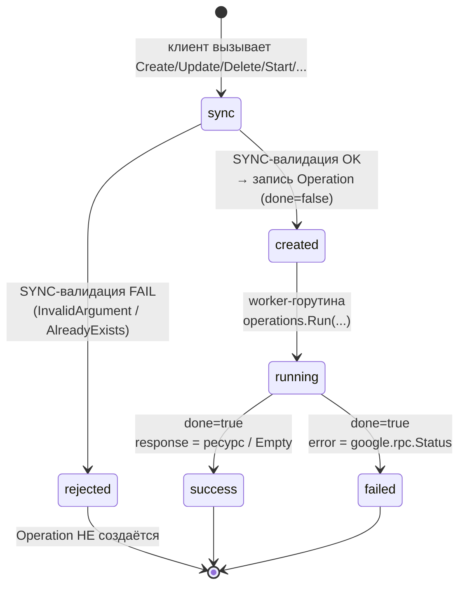
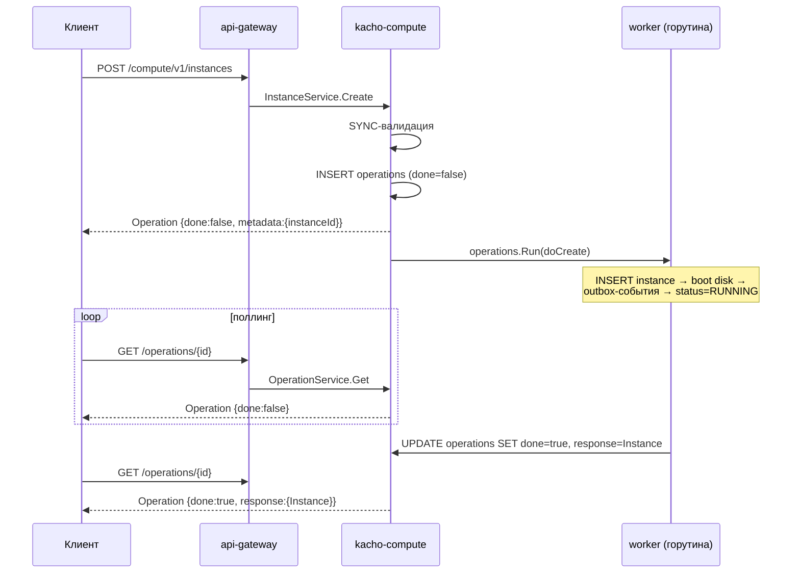

import { TYPES } from '@site/src/constants/types'
import { Codes } from '@site/src/components/commonBlocks/Codes'
import { ApiOperation } from '@site/src/components/commonBlocks/ApiOperation'
import CodeBlock from '@theme/CodeBlock'
import dedent from 'ts-dedent'

# Operations (LRO)

## Зачем нужна модель Operation

Изменение вычислительного ресурса — это не мгновенный факт, а **намерение**, которое платформа
исполняет: создать инстанс с диском, присоединить диск, перевести ВМ в другое состояние. Чтобы
клиент не блокировался на время исполнения и при этом всегда мог узнать «что в итоге
получилось», Kachō вводит единую абстракцию — **Operation** (Long Running Operation, LRO).
Мутирующий RPC сразу возвращает «квитанцию» с идентификатором, а результат (или ошибку) клиент
забирает позже, опрашивая операцию. Эта квитанция durable: она переживает рестарт сервиса,
повторное чтение идемпотентно, а в `metadata` сразу лежит id создаваемого ресурса.

**Operation** — асинхронная долгоиграющая операция. Каждая **мутация** в Kachō Compute
(`Create` / `Update` / `Delete`, а также `Start` / `Stop` / `Restart` / `AttachDisk` /
`DetachDisk` / `UpdateMetadata` / `AttachNetworkInterface` / …) выполняется **не синхронно**:
RPC сразу возвращает `Operation` с `done: false`, а реальная работа идёт в worker-горутине.
Клиент **поллит** статус операции по её `id`, пока не получит `done: true`.

:::info Почему так
Синхронный возврат ресурса из мутирующего RPC **запрещён** конвенциями Kachō. Единая
async-модель даёт устойчивый контракт: клиент не блокируется на длинных операциях, повторный
опрос идемпотентен, а сама запись об операции (вместе с результатом или ошибкой) переживает
рестарт сервиса — она хранится в таблице `operations` базы `kacho_compute`.
:::

## Структура Operation

`Operation` (`kacho.cloud.operation.v1.Operation`) — плоский envelope с полем-результатом в
виде `oneof`:

<table>
  <thead><tr><th>Поле</th><th>Тип</th><th>Описание</th></tr></thead>
  <tbody>
    <tr><td><code>id</code></td><td><code>{TYPES.string}</code></td><td>Идентификатор операции. Все Compute-операции используют префикс <code>epd</code> — по нему api-gateway маршрутизирует <code>OperationService.Get</code> в backend Compute</td></tr>
    <tr><td><code>description</code></td><td><code>{TYPES.string}</code></td><td>Человекочитаемое описание (например <code>Create instance web-1</code>)</td></tr>
    <tr><td><code>createdAt</code></td><td><code>{TYPES.timestamp}</code></td><td>Время постановки операции (усечено до секунд)</td></tr>
    <tr><td><code>done</code></td><td><code>{TYPES.bool}</code></td><td><code>false</code> — операция ещё выполняется; <code>true</code> — завершена, выставлен ровно один из <code>error</code> / <code>response</code></td></tr>
    <tr><td><code>metadata</code></td><td><code>google.protobuf.Any</code></td><td>Сервис-специфичная метадата (как правило id целевого ресурса). Доступна сразу, ещё до завершения</td></tr>
    <tr><td><code>error</code></td><td><code>google.rpc.Status</code></td><td>Результат при неудаче: <code>&#123;code, message, details[]&#125;</code>. Часть <code>oneof result</code></td></tr>
    <tr><td><code>response</code></td><td><code>google.protobuf.Any</code></td><td>Результат при успехе: целевой ресурс (Create/Update) либо <code>google.protobuf.Empty</code> (Delete/Stop/Restart). Часть <code>oneof result</code></td></tr>
  </tbody>
</table>

:::note Инвариант oneof result
Пока <code>done: false</code> — **ни** <code>error</code>, **ни** <code>response</code> не заполнены. При
<code>done: true</code> — выставлен **ровно один** из них. Клиент сначала проверяет <code>done</code>,
затем — какая ветвь <code>oneof</code> заполнена.
:::

Поля-идентификаторы субъекта (кто инициировал операцию) заполняются auth-интерцептором;
`modifiedAt` — время последнего изменения записи (выставляется при переводе в `done`).

## Жизненный цикл

Важно: **синхронные** ошибки (regex имени, размер вне диапазона, immutable-поле в `updateMask`,
дубль `(projectId, name)`) возвращаются **сразу как gRPC-ошибка** — `Operation` при этом **не
создаётся**. **Асинхронные** ошибки (несуществующий project, недоступность peer-сервиса,
нарушение precondition state-машины, not-found источника в worker'е) фиксируются **внутри** уже
созданной операции — в поле `error` при `done: true`.

## OperationService.Get

<ApiOperation method="GET" endpoint="/operations/{operationId}">

Возвращает текущее состояние операции по её идентификатору. Это **синхронный read** — основа
паттерна поллинга. Маршрутизация в нужный backend идёт по 3-символьному префиксу `id`
(`epd…` → kacho-compute).

#### Пример ответа — операция выполняется

<CodeBlock language="json">
  {dedent`
    {
      "id": "{operationId}",
      "description": "Create instance web-1",
      "createdAt": "2026-06-06T14:27:00Z",
      "done": false,
      "metadata": {
        "@type": "type.googleapis.com/kacho.cloud.compute.v1.CreateInstanceMetadata",
        "instanceId": "{instanceId}"
      }
    }
  `}
</CodeBlock>

#### Пример ответа — операция завершена успешно

<CodeBlock language="json">
  {dedent`
    {
      "id": "{operationId}",
      "description": "Create instance web-1",
      "createdAt": "2026-06-06T14:27:00Z",
      "modifiedAt": "2026-06-06T14:27:01Z",
      "done": true,
      "metadata": {
        "@type": "type.googleapis.com/kacho.cloud.compute.v1.CreateInstanceMetadata",
        "instanceId": "{instanceId}"
      },
      "response": {
        "@type": "type.googleapis.com/kacho.cloud.compute.v1.Instance",
        "id": "{instanceId}",
        "projectId": "{projectId}",
        "name": "web-1",
        "status": "RUNNING"
      }
    }
  `}
</CodeBlock>

#### Пример ответа — операция завершена с ошибкой

<CodeBlock language="json">
  {dedent`
    {
      "id": "{operationId}",
      "description": "Attach disk to instance {instanceId}",
      "done": true,
      "metadata": {
        "@type": "type.googleapis.com/kacho.cloud.compute.v1.AttachInstanceDiskMetadata",
        "instanceId": "{instanceId}",
        "diskId": "{diskId}"
      },
      "error": {
        "code": 9,
        "message": "The disk is being used",
        "details": []
      }
    }
  `}
</CodeBlock>

<Codes codes={['invalidArgument', 'notFound', 'permissionDenied', 'internal']} />

</ApiOperation>

## OperationService.Cancel

<ApiOperation method="POST" endpoint="/operations/{operationId}:cancel">

Запрашивает отмену операции, которая ещё выполняется. Это **best-effort**: в control-plane
операции завершаются за доли секунды, поэтому отмена обычно не успевает примениться — операция
уже `done`. Маршрутизация — по тому же префиксу `id` (`epd…` → kacho-compute).

#### Пример запроса

<CodeBlock language="bash">
  {dedent`
    curl -X POST http://localhost:18080/operations/{operationId}:cancel \\
      -H 'Authorization: Bearer <JWT>'
  `}
</CodeBlock>

<Codes codes={['invalidArgument', 'notFound', 'failedPrecondition', 'internal']} />

</ApiOperation>

## Паттерн поллинга

Клиент опрашивает `GET /operations/{operationId}` с небольшим интервалом, пока не увидит
`done: true`, после чего читает результат из соответствующей ветви `oneof`.

<CodeBlock language="bash">
  {dedent`
    OP={operationId}
    until curl -s http://localhost:18080/operations/$OP \\
            -H 'Authorization: Bearer <JWT>' | grep -q '"done": *true'; do
      sleep 1
    done
    curl -s http://localhost:18080/operations/$OP -H 'Authorization: Bearer <JWT>'
  `}
</CodeBlock>

:::tip Рекомендации по поллингу
- Интервал **2–5 секунд**; для большинства Compute-операций результат готов в течение секунды.
- Операция **идемпотентна на чтение** — повторный `Get` после `done: true` всегда отдаёт тот же финальный результат.
- Server-streaming `Watch` в публичном API **не существует** — поллинг `Get` (или `List` ресурса каждые 2–5 с) и есть штатный механизм.
:::

## Метадата операции

Поле `metadata` (`google.protobuf.Any`) заполняется **сразу** при постановке операции и несёт
id целевого ресурса — так клиент узнаёт `id` ещё **до** завершения `Create`.

<table>
  <thead><tr><th>Тип метадаты (<code>@type</code>)</th><th>Поле(-я)</th></tr></thead>
  <tbody>
    <tr><td><code>CreateInstanceMetadata</code></td><td><code>instanceId</code></td></tr>
    <tr><td><code>CreateDiskMetadata</code></td><td><code>diskId</code></td></tr>
    <tr><td><code>CreateImageMetadata</code></td><td><code>imageId</code></td></tr>
    <tr><td><code>CreateSnapshotMetadata</code></td><td><code>snapshotId</code>, <code>diskId</code></td></tr>
    <tr><td><code>AttachInstanceDiskMetadata</code></td><td><code>instanceId</code>, <code>diskId</code></td></tr>
    <tr><td><code>DeleteInstanceMetadata</code></td><td><code>instanceId</code></td></tr>
  </tbody>
</table>

## Результат операции (oneof result)

<table>
  <thead><tr><th>Операция</th><th><code>response</code> (<code>@type</code>)</th></tr></thead>
  <tbody>
    <tr><td><code>Create&lt;Res&gt;</code> / <code>Update&lt;Res&gt;</code> / <code>Start</code> / <code>AttachDisk</code></td><td>Целевой ресурс — например <code>compute.v1.Instance</code></td></tr>
    <tr><td><code>Delete&lt;Res&gt;</code> / <code>Stop</code> / <code>Restart</code></td><td><code>google.protobuf.Empty</code> — данных нет</td></tr>
  </tbody>
</table>

:::note Delete/Stop/Restart → response = Empty
Для этих операций `response` — `google.protobuf.Empty` (`{}`): результирующего ресурса в ответе
нет, но его id остаётся доступен в `metadata`. При неуспехе вместо `response` заполняется
`error`.
:::

## ListOperations по ресурсу

Глобального «списка всех операций» нет — операции перечисляются **в контексте конкретного
ресурса**. Каждый сервис экспонирует `ListOperations` под path-ом своего ресурса:

<table>
  <thead><tr><th>Ресурс</th><th>REST</th></tr></thead>
  <tbody>
    <tr><td>Instance</td><td><code>GET /compute/v1/instances/&#123;instanceId&#125;/operations</code></td></tr>
    <tr><td>Disk</td><td><code>GET /compute/v1/disks/&#123;diskId&#125;/operations</code></td></tr>
    <tr><td>Image</td><td><code>GET /compute/v1/images/&#123;imageId&#125;/operations</code></td></tr>
    <tr><td>Snapshot</td><td><code>GET /compute/v1/snapshots/&#123;snapshotId&#125;/operations</code></td></tr>
  </tbody>
</table>

Эти методы поддерживают cursor-пагинацию (`pageSize` / `pageToken`), как и обычный `List`.

## Подводные камни и рекомендации

:::caution Что важно знать
- **Сначала проверяйте `done`, потом ветвь `oneof`.** Пока `done: false`, обращаться к `response` бессмысленно.
- **Sync-ошибки и async-ошибки приходят по-разному.** Ошибки валидации возвращаются **сразу как gRPC-ошибка**, и `Operation` не создаётся. Ошибки исполнения (precondition state-машины, недоступность peer-сервиса, not-found источника) попадают **в `error` готовой операции** при `done: true`. Обрабатывайте оба пути.
- **`metadata` доступна сразу, `response` — нет.** id создаваемого ресурса известен из `metadata` ещё до завершения.
- **`Delete`/`Stop`/`Restart` не возвращают ресурс.** Успешный `response` — `google.protobuf.Empty` (`{}`).
:::
