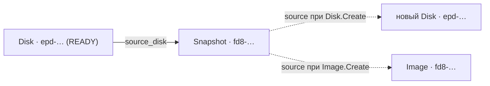

import { DICTIONARY } from '@site/src/constants/dictionary'
import { TYPES } from '@site/src/constants/types'
import { RESTRICTIONS } from '@site/src/constants/restrictions'
import { Restrictions } from '@site/src/components/commonBlocks/Restrictions'
import { Codes } from '@site/src/components/commonBlocks/Codes'
import { StatusTable } from '@site/src/components/commonBlocks/StatusTable'
import { ApiOperation } from '@site/src/components/commonBlocks/ApiOperation'
import CodeBlock from '@theme/CodeBlock'
import dedent from 'ts-dedent'

# Snapshot

**Snapshot** — точечный снимок состояния диска: сохранённая копия данных диска на конкретный
момент времени. Вы делаете `Snapshot`, когда нужно зафиксировать состояние диска — перед
рискованным изменением, для резервной копии или как исходную точку для создания новых дисков
и образов.

Снимок создаётся из диска (`diskId`, диск должен быть `READY`) и хранит `sourceDiskId` — id
исходного диска. Из снимка можно восстановить диск (передав `snapshotId` в `source` при
`Disk.Create`) или создать образ (`snapshotId` в `Image.Create`). Исходный диск при этом
можно свободно менять или удалять — снимок самодостаточен.

:::info Идентификатор и владелец
ID снимка — префикс `fd8` + 17 символов crockford-base32 (например, `fd83v5x7z9b1d4f6h8j0`;
префикс общий с Image). Снимок принадлежит проекту `kacho-iam` (`projectId`, immutable).
:::

## Поля ресурса

<table>
  <thead><tr><th>Поле</th><th>Тип</th><th>Описание</th></tr></thead>
  <tbody>
    <tr><td><code>id</code></td><td><code>{TYPES.string}</code></td><td>{DICTIONARY.id.short}</td></tr>
    <tr><td><code>projectId</code></td><td><code>{TYPES.string}</code></td><td>{DICTIONARY.projectId.short}</td></tr>
    <tr><td><code>name</code></td><td><code>{TYPES.string}</code></td><td>{DICTIONARY.name.short}</td></tr>
    <tr><td><code>description</code></td><td><code>{TYPES.string}</code></td><td>{DICTIONARY.description.short}</td></tr>
    <tr><td><code>labels</code></td><td><code>{TYPES.mapStringString}</code></td><td>{DICTIONARY.labels.short}</td></tr>
    <tr><td><code>createdAt</code></td><td><code>{TYPES.timestamp}</code></td><td>{DICTIONARY.createdAt.short}</td></tr>
    <tr><td><code>sourceDiskId</code></td><td><code>{TYPES.string}</code></td><td>{DICTIONARY.sourceDiskId.short}</td></tr>
    <tr><td><code>diskSize</code></td><td><code>{TYPES.int64}</code></td><td>{DICTIONARY.diskSizeAtSnapshot.short}</td></tr>
    <tr><td><code>storageSize</code></td><td><code>{TYPES.int64}</code></td><td>{DICTIONARY.storageSize.short}</td></tr>
    <tr><td><code>status</code></td><td><code>{TYPES.status}</code></td><td>{DICTIONARY.status.short}</td></tr>
  </tbody>
</table>

### Статусы

<StatusTable values={[
  { code: 'CREATING', desc: 'Снимок создаётся' },
  { code: 'READY', desc: 'Снимок готов к использованию (в control-plane выставляется сразу после Create)' },
  { code: 'ERROR', desc: 'Снимок в ошибочном состоянии' },
  { code: 'DELETING', desc: 'Снимок удаляется' },
]} />

---

## Get

<ApiOperation method="GET" endpoint="/compute/v1/snapshots/{snapshotId}">

Возвращает снимок по идентификатору.

#### Пример ответа

<CodeBlock language="json">
  {dedent`
    {
      "id": "{snapshotId}",
      "projectId": "{projectId}",
      "name": "data-disk-snap",
      "sourceDiskId": "{diskId}",
      "diskSize": "8589934592",
      "storageSize": "1073741824",
      "status": "READY",
      "createdAt": "2026-06-06T14:27:00Z"
    }
  `}
</CodeBlock>

<Codes codes={['invalidArgument', 'notFound', 'permissionDenied', 'internal']} />

</ApiOperation>

---

## List

<ApiOperation method="GET" endpoint="/compute/v1/snapshots">

Список снимков проекта с фильтром и cursor-пагинацией.

#### Параметры запроса

<table>
  <thead><tr><th>Параметр</th><th>Обязательность</th><th>Тип</th><th>Описание</th></tr></thead>
  <tbody>
    <tr><td><code>projectId</code></td><td><strong>да</strong></td><td><code>{TYPES.string}</code></td><td>{DICTIONARY.projectId.short}</td></tr>
    <tr><td><code>filter</code></td><td>нет</td><td><code>{TYPES.string}</code></td><td>{DICTIONARY.filter.short}</td></tr>
    <tr><td><code>pageSize</code></td><td>нет</td><td><code>{TYPES.int64}</code></td><td>{DICTIONARY.pageSize.short}</td></tr>
    <tr><td><code>pageToken</code></td><td>нет</td><td><code>{TYPES.string}</code></td><td>{DICTIONARY.pageToken.short}</td></tr>
  </tbody>
</table>

#### Пример ответа

<CodeBlock language="json">
  {dedent`
    {
      "snapshots": [
        { "id": "{snapshotId}", "projectId": "{projectId}", "name": "data-disk-snap", "sourceDiskId": "{diskId}", "status": "READY" }
      ],
      "nextPageToken": ""
    }
  `}
</CodeBlock>

<Restrictions items={[{ label: 'pagination', rules: RESTRICTIONS.pagination }]} />
<Codes codes={['invalidArgument', 'permissionDenied', 'internal']} />

</ApiOperation>

---

## Create

<ApiOperation method="POST" endpoint="/compute/v1/snapshots" async>

Создаёт снимок из диска. Возвращает `Operation` (async). Диск (`diskId`) должен существовать и
быть в статусе `READY`; в `metadata` возвращаются `snapshotId` и `diskId`.

#### Тело запроса

<table>
  <thead><tr><th>Параметр</th><th>Обязательность</th><th>Тип</th><th>Описание</th></tr></thead>
  <tbody>
    <tr><td><code>projectId</code></td><td><strong>да</strong></td><td><code>{TYPES.string}</code></td><td>{DICTIONARY.projectId.short}</td></tr>
    <tr><td><code>diskId</code></td><td><strong>да</strong></td><td><code>{TYPES.string}</code></td><td>Исходный диск (должен быть READY)</td></tr>
    <tr><td><code>name</code></td><td>нет</td><td><code>{TYPES.string}</code></td><td>{DICTIONARY.name.short}</td></tr>
    <tr><td><code>description</code></td><td>нет</td><td><code>{TYPES.string}</code></td><td>{DICTIONARY.description.short}</td></tr>
    <tr><td><code>labels</code></td><td>нет</td><td><code>{TYPES.mapStringString}</code></td><td>{DICTIONARY.labels.short}</td></tr>
  </tbody>
</table>

#### Пример запроса

<CodeBlock language="bash">
  {dedent`
    curl -X POST http://localhost:18080/compute/v1/snapshots \\
      -H 'Authorization: Bearer <JWT>' \\
      -H 'Content-Type: application/json' \\
      -d '{
        "projectId": "{projectId}",
        "diskId": "{diskId}",
        "name": "data-disk-snap"
      }'
  `}
</CodeBlock>

#### Пример ответа (Operation)

<CodeBlock language="json">
  {dedent`
    {
      "id": "{operationId}",
      "description": "Create snapshot data-disk-snap",
      "done": false,
      "metadata": {
        "@type": "type.googleapis.com/kacho.cloud.compute.v1.CreateSnapshotMetadata",
        "snapshotId": "{snapshotId}",
        "diskId": "{diskId}"
      }
    }
  `}
</CodeBlock>

<Restrictions items={[
  { label: 'projectId', rules: RESTRICTIONS.projectId },
  { label: 'name', rules: RESTRICTIONS.name },
  { label: 'labels', rules: RESTRICTIONS.labels },
]} />
<Codes codes={['invalidArgument', 'alreadyExists', 'notFound', 'failedPrecondition', 'unavailable', 'permissionDenied', 'internal']} />

</ApiOperation>

---

## Update

<ApiOperation method="PATCH" endpoint="/compute/v1/snapshots/{snapshotId}" async>

Изменяет mutable-поля снимка (`name`, `description`, `labels`). Поля `sourceDiskId`,
`diskSize`, `storageSize` — immutable.

#### Пример запроса

<CodeBlock language="bash">
  {dedent`
    curl -X PATCH http://localhost:18080/compute/v1/snapshots/{snapshotId} \\
      -H 'Authorization: Bearer <JWT>' \\
      -H 'Content-Type: application/json' \\
      -d '{ "updateMask": "labels", "labels": { "keep": "monthly" } }'
  `}
</CodeBlock>

<Restrictions items={[{ label: 'updateMask', rules: RESTRICTIONS.updateMask }]} />
<Codes codes={['invalidArgument', 'notFound', 'permissionDenied', 'internal']} />

</ApiOperation>

---

## Delete

<ApiOperation method="DELETE" endpoint="/compute/v1/snapshots/{snapshotId}" async>

Удаляет снимок (hard-delete). Диски, созданные из снимка, удаление не блокируют (нет жёсткого
FK через границу).

#### Пример запроса

<CodeBlock language="bash">
  {dedent`
    curl -X DELETE http://localhost:18080/compute/v1/snapshots/{snapshotId} \\
      -H 'Authorization: Bearer <JWT>'
  `}
</CodeBlock>

<Codes codes={['invalidArgument', 'notFound', 'permissionDenied', 'internal']} />

</ApiOperation>

---

## ListOperations

<ApiOperation method="GET" endpoint="/compute/v1/snapshots/{snapshotId}/operations">

Список асинхронных операций над указанным снимком с cursor-пагинацией.

<Restrictions items={[{ label: 'pagination', rules: RESTRICTIONS.pagination }]} />
<Codes codes={['invalidArgument', 'notFound', 'permissionDenied', 'internal']} />

</ApiOperation>

---

## Сценарии использования

- **Резервная копия.** Снимайте `Snapshot` перед рискованными изменениями — при необходимости
  восстановите диск из снимка (`snapshotId` в `Disk.Create`).
- **Клонирование.** Из одного снимка создавайте несколько одинаковых дисков для однотипных
  инстансов.
- **Мост к образу.** Снимок диска → `Image.Create` с `snapshotId` — так эталон превращается в
  переиспользуемый образ с семейством.

## Подводные камни

:::caution Диск должен быть READY
`Create` требует существующего диска в статусе `READY`. Диск в `CREATING` / `DELETING` /
`ERROR` → `FAILED_PRECONDITION`. Присоединённый к инстансу диск остаётся `READY` — снимать с
него снимок можно, не отсоединяя.
:::

:::note Снимок переживает исходный диск
`sourceDiskId` — просто ссылка (не FK через границу): исходный диск можно изменить или
удалить, снимок останется целостным и пригодным для восстановления.
:::
