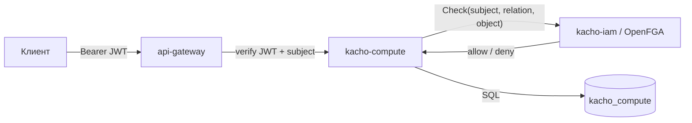

# Авторизация и приватность

Эта страница описывает модель безопасности kacho-compute: аутентификацию, авторизацию per-RPC,
границу public/internal и защиту инфра-чувствительных данных. Инвариант платформы Kachō —
**никаких неаутентифицированных и неавторизованных запросов ни на одном порту**.

## Аутентификация (AuthN)

- **Внешние клиенты** (`user → edge`): TLS + **JWT**. `api-gateway` проверяет
  `Authorization: Bearer <token>`; отсутствующий/невалидный токен → `UNAUTHENTICATED` (401)
  ещё до доменного сервиса. Из токена извлекается субъект (account / service-account).
- **Peer-сервисы** (`service → service`): **mTLS** (verified client-cert). Внутренний listener
  `:9091` не освобождён — mTLS обязателен и там.

Plaintext/insecure-gRPC в проде запрещён. dev-mode «anonymous → full access» допустим только в
локальных unit/integration-фикстурах — в развёрнутом стенде каждый запрос проходит AuthN.

## Авторизация (AuthZ) — per-RPC ReBAC

Каждый RPC (public **и** internal) проходит per-RPC **Check** через OpenFGA (ReBAC,
relation-based). kacho-compute вызывает `InternalIAMService.Check` в kacho-iam (где живут FGA
tuples); интерсептор проверяет, что субъект имеет нужное отношение (`relation`) на целевой
ресурс или его проект:

- **read** (`Get` / `List`) — отношение `viewer`-tier;
- **мутации** (`Create` / `Update` / `Delete` / lifecycle-действия) — `editor`-tier.

Нет отношения → `PERMISSION_DENIED` (403). Недоступность kacho-iam на request-path →
`UNAVAILABLE` (fail-closed для мутаций).

## Регистрация owner-tuple

При создании ресурса kacho-compute регистрирует owner-hierarchy-tuple в OpenFGA **через
kacho-iam** (`InternalIAMService.RegisterResource`) — модуль не ходит в FGA напрямую. Запись
идемпотентна, at-least-once через transactional-outbox (drainer). Так создатель ресурса и
члены проекта получают доступ по правилам ReBAC.

## Фильтрация List

Публичный `List<Resource>` не просто проверяет доступ к вызову, но и **фильтрует выдачу**: в
списке видны только те ресурсы, на которые у субъекта есть отношение (listauthz). Это
защищает от утечки существования чужих ресурсов через список.

## Граница public / internal

| Listener | Кто ходит | Что доступно |
|---|---|---|
| `:9090` public | tenant через api-gateway (TLS+JWT) | Instance / Disk / Image / Snapshot + read-only `DiskType` |
| `:9091` internal | peer-сервисы / admin (mTLS) | admin-CRUD `DiskType` (`InternalDiskTypeService`), `InternalWatchService` |

`Internal*`-сервисы **не публикуются** на external TLS endpoint. Их REST-проекция в
api-gateway доступна только на cluster-internal mux. Так admin-функции (управление каталогом
типов дисков) не попадают на публичную поверхность — даже скомпрометированный публичный API их
не откроет.

## Инфра-чувствительные данные

Публичная проекция ресурса показывает только tenant-facing «намерение и результат»: id, name,
labels, привязки (project / zone / диски / сеть), статус. Данные, которые помогают
картировать физику и data-plane (на каком хосте лежит инстанс, host-группы), на публичной
поверхности **не раскрываются**.

:::note Placement убран из публичного Instance
Поля привязки инстанса к физическому хосту и host-группе исключены из публичного сообщения
`Instance` (defense-in-depth): раскрытие placement — разведка для lateral movement (tenant не
должен вывести «мой и чужой инстанс на одном железе»). Если такие данные нужны админ-инструментам,
они живут только на internal-проекции за `Internal*` API.
:::
