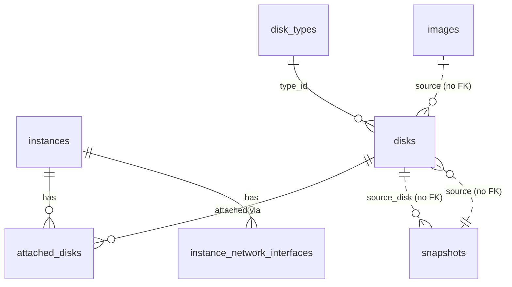

# Модель данных

Эта страница описывает **как данные хранятся и связаны** внутри kacho-compute: таблицы схемы
`kacho_compute`, внешние ключи, статусы и ID-префиксы. Пользовательский контракт (поля, RPC) —
на страницах ресурсов раздела [API](/api/overview); здесь — внутренняя проекция.

## Схема и таблицы

Все данные живут в схеме **`kacho_compute`** одной базы (database-per-service). Таблицы
плоские (без K8s-envelope), id-колонки — `TEXT`. Ключевые таблицы:

| Таблица | Роль |
|---|---|
| `instances` | Инстансы (виртуальные машины) |
| `disks` | Диски |
| `images` | Образы |
| `snapshots` | Снимки |
| `disk_types` | Справочник типов дисков (read-only на публичном API) |
| `attached_disks` | Связь инстанс ↔ диск (M:N, флаги `auto_delete`, `is_boot`) |
| `instance_network_interfaces` | Сетевые интерфейсы инстанса (зеркало NIC из kacho-vpc) |
| `operations` | Записи асинхронных операций (LRO; общая модель corelib) |
| `compute_outbox` | Transactional outbox событий |

## Связи (ER)

### Внешние ключи (same-DB only)

| Связь | FK | ON DELETE | Смысл |
|---|---|---|---|
| `attached_disks.disk_id → disks` | да | **RESTRICT** | Присоединённый диск нельзя удалить (`"The disk is being used"`) |
| `attached_disks.instance_id → instances` | да | **CASCADE** | При удалении инстанса строки связи чистятся |
| `instance_network_interfaces.instance_id → instances` | да | **CASCADE** | NIC-строки — same-table children инстанса |

### Ссылки без FK

Через границу сервиса FK невозможен (database-per-service). Эти ссылки — просто `TEXT`,
валидируются на request-path вызовом owner-сервиса либо не валидируются вовсе:

| Ссылка | Owner | Валидация |
|---|---|---|
| `instances.project_id` / `disks.project_id` / … | kacho-iam | `ProjectService.Get` на Create |
| `instances.zone_id` / `disks.zone_id` | kacho-geo | `ZoneService.Get` на Create |
| `disks.type_id` | локальный `disk_types` | existence-check в БД compute |
| `disks.source_image_id` / `source_snapshot_id` | локальные `images`/`snapshots` | existence-check только на Create; **не FK** (источник можно удалить) |
| `snapshots.source_disk_id` | локальный `disks` | existence-check только на Create; **не FK** |
| `instance_network_interfaces.nic_id` | kacho-vpc `NetworkInterface` | denormalised-зеркало; source of truth — kacho-vpc |

:::note Источник — не FK намеренно
`Disk` хранит id образа/снимка, из которого создан, но образ/снимок можно удалить — диск при
этом продолжает существовать. Так снимки и образы остаются самостоятельными, а не «заложниками»
созданных из них дисков. Consumer обязан переживать dangling-ref.
:::

## Статусы ресурсов

| Ресурс | Значения `status` |
|---|---|
| **Instance** | `PROVISIONING`, `RUNNING`, `STOPPING`, `STOPPED`, `STARTING`, `RESTARTING`, `UPDATING`, `ERROR`, `CRASHED`, `DELETING` |
| **Disk** | `CREATING`, `READY`, `ERROR`, `DELETING` |
| **Image** | `CREATING`, `READY`, `ERROR`, `DELETING` |
| **Snapshot** | `CREATING`, `READY`, `ERROR`, `DELETING` |

В control-plane переходы детерминированы: Disk / Image / Snapshot создаются сразу в `READY`,
Instance проходит state-машину (см. [Жизненный цикл Instance](/architecture/instance-lifecycle)).

## ID-префиксы

Идентификатор — `TEXT`: 3-символьный префикс + 17 символов crockford-base32
(`kacho-corelib/ids`).

| Ресурс | Префикс | Пример |
|---|---|---|
| Instance | `epd` | `epd7t4w9e2x5h8mz0c3v` |
| Disk | `epd` | `epd0am5d8q1w4e7r2t6y` |
| Image | `fd8` | `fd83v5x7z9b1d4f6h8j0` |
| Snapshot | `fd8` | `fd8k3xe746h019hnz182` |
| Operation (Compute) | `epd` | `epdk3xe746h019hnz182` |
| DiskType | — (литерал) | `network-ssd` |

:::note Общие префиксы
Instance и Disk делят `epd`; Image и Snapshot — `fd8` (группировка по домену внутри сервиса).
Тип ресурса различается контекстом RPC, а не только префиксом. Все Compute-операции получают
`epd` — по нему api-gateway маршрутизирует `OperationService.Get` в этот backend.
:::

## Ошибки и маппинг SQLSTATE

Сервисный слой транслирует repo-sentinel'ы и SQLSTATE в gRPC-коды (единая точка —
`internal/service/maperr.go`). Тексты — часть контракта (стабильны):

| Условие | SQLSTATE | gRPC | Текст (пример) |
|---|---|---|---|
| Не найдено | — | `NOT_FOUND` | `"<Resource> <id> not found"` |
| Дубль `(project_id, name)` | `23505` | `ALREADY_EXISTS` | — |
| FK RESTRICT (attached disk) | `23503` | `FAILED_PRECONDITION` | `"The disk is being used"` |
| Precondition state-машины | — | `FAILED_PRECONDITION` | `"Instance must be stopped"` / `"Instance is not running"` |
| Валидация (размер, cores, zone) | `23514` | `INVALID_ARGUMENT` | `"Disk size can only be increased"` |
| Внутренняя ошибка БД | — | `INTERNAL` | `"internal database error"` (без leak pgx/SQL) |

## Миграции

Схема версионируется goose (`internal/migrations/*.sql`, embed.FS). `0001_initial.sql` —
squashed baseline: `operations`, `disk_types`, `disks`, `images`, `snapshots`, `instances`,
`instance_network_interfaces`, `attached_disks`, `compute_outbox` + индексы, partial UNIQUE, FK,
outbox-trigger, seed `disk_types`. Применённые миграции не редактируются — только новые.
