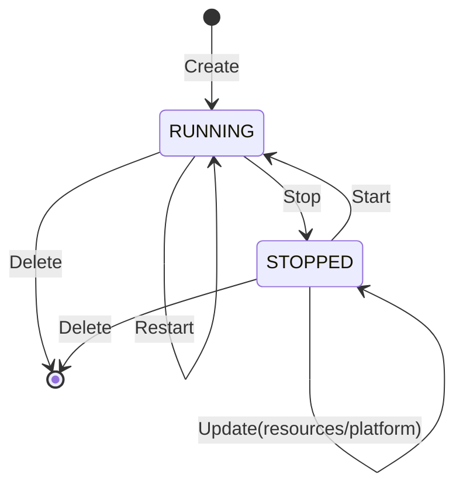
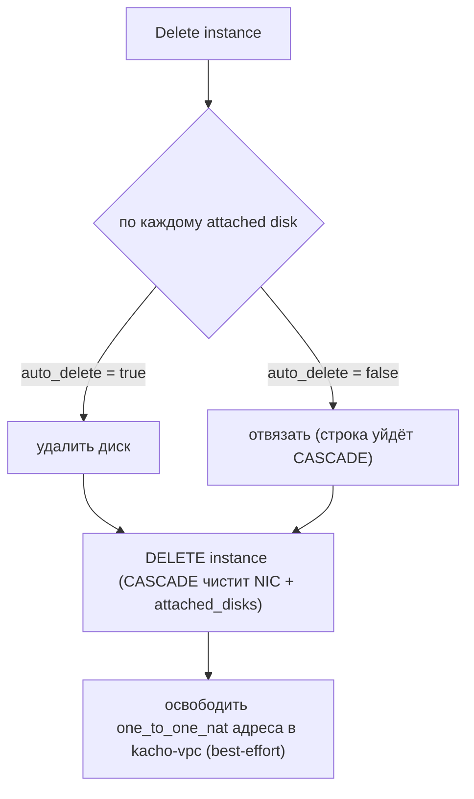

# Жизненный цикл Instance

Инстанс проходит через набор состояний (`status`), а переходы между ними имеют **явные
предусловия**. Эта страница описывает state-машину: какие статусы бывают, какие RPC переводят
инстанс из одного состояния в другое и какие ошибки возвращаются при нарушении предусловий.

:::info Control-plane имитация
Реального гипервизора нет. Статус переводится **детерминированно внутри worker'а операции**:
проверяется предусловие, статус меняется на конечное значение в той же транзакции — без таймеров
и промежуточных «переходных» задержек. Поэтому `Stop` сразу приводит к `STOPPED`, `Start` — к
`RUNNING`. Переходные статусы (`STOPPING`, `STARTING`, …) существуют в модели, но в
control-plane инстанс не задерживается в них наблюдаемо.
:::

## Статусы

| Статус | Значение |
|---|---|
| `PROVISIONING` | Идёт выделение ресурсов (фаза Create) |
| `RUNNING` | Инстанс работает — нормальное рабочее состояние |
| `STOPPING` / `STARTING` / `RESTARTING` | Переходные состояния операций Stop / Start / Restart |
| `STOPPED` | Инстанс остановлен |
| `UPDATING` | Применяются изменения |
| `ERROR` | Ошибочное состояние |
| `CRASHED` | Аварийное завершение |
| `DELETING` | Идёт удаление |

## Диаграмма переходов

## Таблица переходов и предусловий

| RPC | Предусловие (иначе `FAILED_PRECONDITION`) | Конечный статус | `response` |
|---|---|---|---|
| `Create` | — | `RUNNING` | Instance |
| `Start` | статус ∈ {`STOPPED`} | `RUNNING` | Instance |
| `Stop` | статус ∈ {`RUNNING`} | `STOPPED` | Empty |
| `Restart` | статус ∈ {`RUNNING`} | `RUNNING` | Empty |
| `Update` (resources / platform) | статус ∈ {`STOPPED`} | `STOPPED` | Instance |
| `Update` (name / labels / …) · `UpdateMetadata` | любой | без изменения | Instance |
| `AttachDisk` | статус ∈ {`RUNNING`, `STOPPED`}; диск `READY`, та же зона, не присоединён | без изменения | Instance |
| `DetachDisk` | статус ∈ {`RUNNING`, `STOPPED`}; диск присоединён и не загрузочный | без изменения | Instance |
| `AttachNetworkInterface` · `DetachNetworkInterface` | статус ∈ {`STOPPED`} | без изменения | Instance |
| `AddOneToOneNat` · `RemoveOneToOneNat` · `UpdateNetworkInterface` | статус ∈ {`RUNNING`, `STOPPED`}; корректный индекс интерфейса | без изменения | Instance |
| `GetSerialPortOutput` | любой (синхронный read, не операция) | — | contents |
| `Delete` | любой (отвязывает диски по `auto_delete`) | (удалён) | Empty |

## Канонические тексты ошибок

Тексты предусловий — **часть контракта Kachō** (стабильны, проверяются регрессионными тестами):

| Ситуация | Текст |
|---|---|
| Изменение ресурсов / platform / attach NIC у работающего инстанса | `"Instance must be stopped"` |
| `Stop` / `Restart` не работающего инстанса | `"Instance is not running"` |
| Удаление / (некоторые операции над) присоединённым диском | `"The disk is being used"` |

## Удаление и судьба дисков

`Instance.Delete` — hard-delete. Worker обрабатывает присоединённые диски по флагу `autoDelete`:

Загрузочный диск, созданный inline при `Create` c `autoDelete=true`, удаляется вместе с
инстансом. Диски данных с `autoDelete=false` — отвязываются и остаются. Освобождение внешних
адресов в kacho-vpc — best-effort: недоступность vpc логируется, но не проваливает операцию
удаления.

:::note Все переходы — через Operation
Каждый переход инициируется мутирующим RPC, который возвращает `Operation`. Наблюдаемое
изменение статуса появляется только после `done: true`. Поллите операцию или `Get` инстанса —
Watch-механизма нет. Подробнее — [Операции](/architecture/operations).
:::
