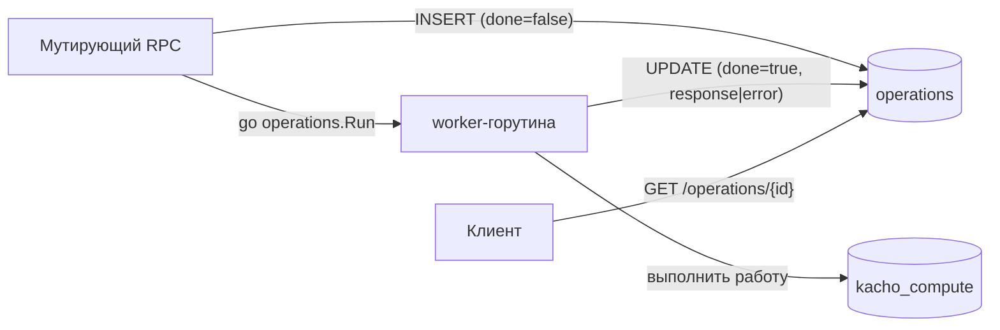
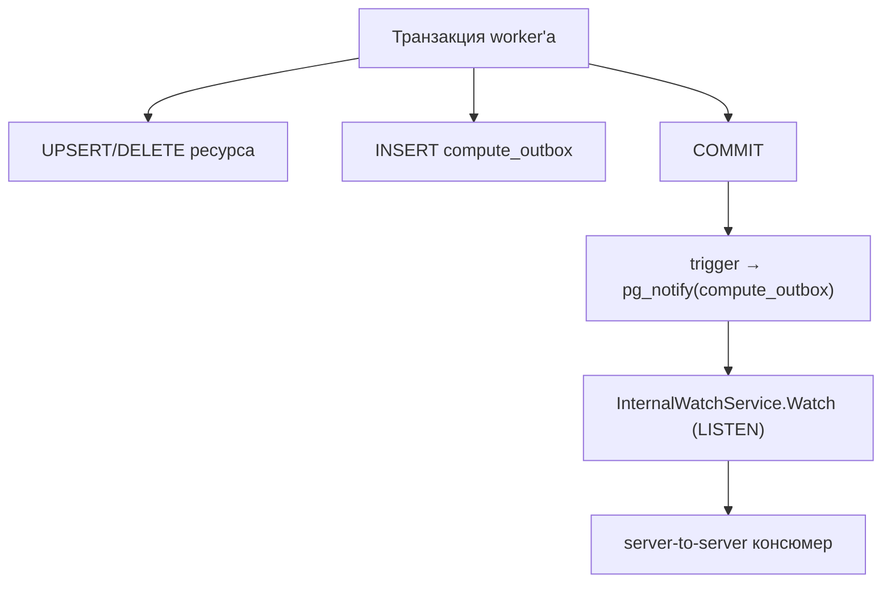

# Операции (внутренняя механика)

Эта страница объясняет, **как реализованы** асинхронные операции (LRO) внутри kacho-compute:
таблица `operations`, worker-модель, transactional outbox и поток событий. Пользовательский
контракт `Operation` (поля, поллинг) — на странице [Operations (LRO)](/api/operations); здесь —
про внутреннее устройство.

## Таблица operations

Каждая мутация фиксируется строкой в таблице `operations` (общая модель из `kacho-corelib`).
Строка создаётся синхронно при постановке (`done=false`), обновляется worker'ом при завершении
(`done=true` + `response` либо `error`). Запись durable — переживает рестарт сервиса, поллинг
идемпотентен.

## Синхронная фаза vs worker

| Фаза | Что делает | Ошибки |
|---|---|---|
| **Синхронная** (в RPC) | Быстрая валидация (формат, regex, диапазоны, immutable-mask); INSERT операции | Возвращаются **сразу** как gRPC-ошибка; операция **не создаётся** |
| **Worker** (`operations.Run`) | Peer-валидация (project/zone/vpc), вставка ресурса, переходы статуса, outbox | Фиксируются **в `operation.error`** при `done: true` |

Это разделение определяет, где клиент увидит ошибку: sync-ошибка приходит в HTTP-ответе
мутации, async-ошибка — в теле операции после `done`.

## Principal в worker'е

Worker запускается в отдельном ctx. Чтобы cross-service вызовы (iam / vpc / geo) не уходили
анонимными, инициатор операции (principal) **явно прокидывается** в worker-ctx, а исходящие
gRPC-вызовы прогоняются через propagation исходящей identity. Фоновые циклы (drainer outbox)
работают под системным principal. Без этого peer-Check отверг бы вызовы worker'а — и мутация
откатилась бы с невнятной внутренней ошибкой.

## Transactional outbox

Изменения ресурса и событие о нём пишутся в **одной транзакции**: строка ресурса + строка в
`compute_outbox`. Так событие не «теряется» при сбое и не публикуется, если транзакция не
закоммитилась (dual-write решён transactional-outbox, без брокера).

## InternalWatchService

`InternalWatchService.Watch` (на internal-порту `:9091`) отдаёт поток событий outbox через
LISTEN/NOTIFY: клиент получает `Event{sequenceNo, resourceKind, resourceId, eventType,
payload, createdAt}`, при необходимости — с указанной точки (`from_sequence_no`). Это
**server-to-server** механизм (не публикуется в api-gateway REST), для внутренних интеграций.
Публичного Watch в API нет — tenant-клиенты используют поллинг.

## Маршрутизация OperationService.Get

`OperationService.Get(id)` / `Cancel(id)` доступны по пути `/operations/{id}` — **без**
`/compute/v1/`-префикса. api-gateway маршрутизирует запрос в нужный backend по 3-символьному
префиксу id операции: `epd…` → kacho-compute. Неизвестный префикс → `INVALID_ARGUMENT`.

:::note Cancel — best-effort
В control-plane операции завершаются за доли секунды, поэтому `Cancel` обычно приходит уже к
завершённой операции. Отмену можно применить только к `done: false`; к завершённой — отклоняется.
:::
