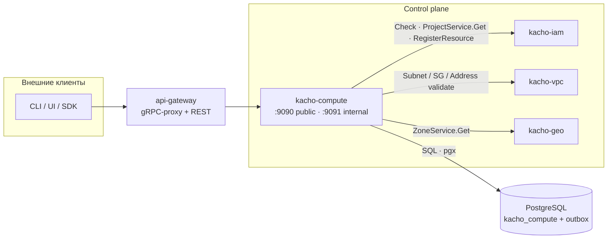
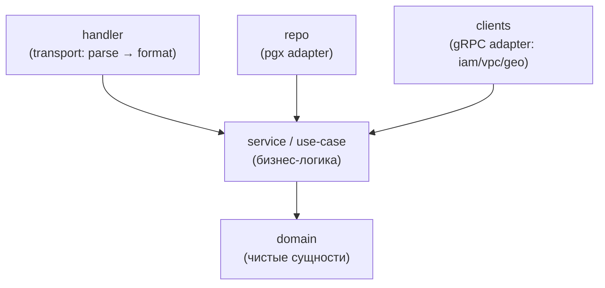
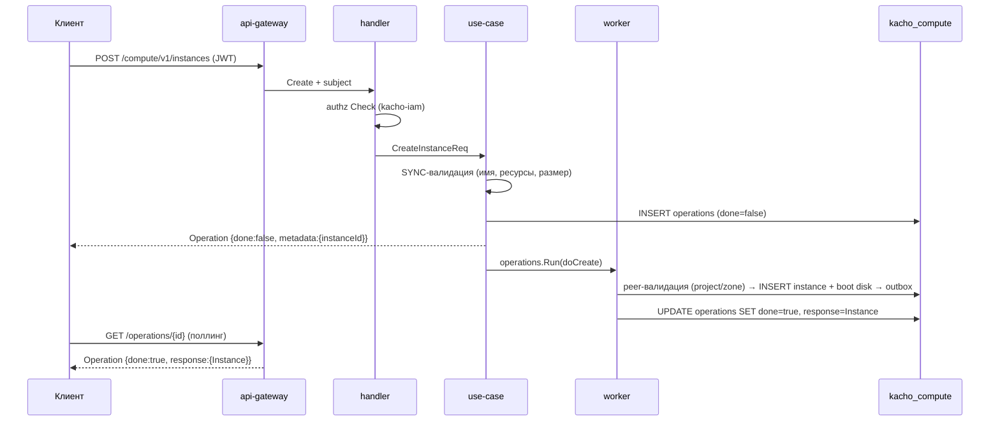

# Обзор архитектуры

Эта страница объясняет, **как устроен** kacho-compute внутри: слои, границы сервиса, поток
запроса и место в платформе Kachō. Если вам нужен справочник по API — начните с
[Обзора API](/api/overview); здесь — про внутреннее устройство и принятые решения.

## Место в платформе

kacho-compute — доменный control-plane сервис вычислительных ресурсов. Он владеет своей базой
`kacho_compute` и общается с другими доменами **только по API** (database-per-service; никаких
cross-service FK). Tenant-запросы приходят через `api-gateway`; смежные домены зовутся напрямую
для валидации ссылок.

| Ребро | Зачем | Тип |
|---|---|---|
| compute → kacho-iam | authz-Check на каждом RPC; `ProjectService.Get` (существование проекта); регистрация owner-tuple в OpenFGA | sync, request-path |
| compute → kacho-vpc | валидация NIC-spec (Subnet / SecurityGroup / Address) при работе с сетевыми интерфейсами | sync, request-path |
| compute → kacho-geo | валидация `zoneId` (`ZoneService.Get`) при Create Instance / Disk | sync, request-path |

Все три ребра **однонаправленные** — compute никого из них не заставляет звать себя обратно
(циклов нет). Peer недоступен на мутации → `UNAVAILABLE` (fail-closed).

## Слои (Clean Architecture)

Сервис следует строгому dependency rule: зависимости направлены внутрь, к домену.

| Слой | Каталог | Ответственность |
|---|---|---|
| `domain` | `internal/domain/` | Сущности (чистый Go): Instance / Disk / Image / Snapshot / DiskType. Без pgx/grpc |
| use-case | `internal/service/` | Бизнес-логика, порты (`internal/ports/`), state-машина, валидация |
| `repo` | `internal/repo/` | Реализация портов через pgx: CRUD, CAS, outbox |
| `clients` | `internal/clients/` | Реализация peer-портов: iam / vpc / geo gRPC-клиенты |
| `handler` | `internal/handler/` | Тонкий transport: proto ↔ use-case, tenant-интерсептор |
| composition | `cmd/compute/` | Единственное место wiring (два listener'а, интерсепторы, пул, worker) |

Бизнес-логика не живёт в handler; domain не импортирует pgx/grpc. Тесты по слоям: unit
use-case на mock-портах, integration через testcontainers, e2e через api-gateway.

## Поток запроса (мутация)

Синхронная фаза выполняет быструю валидацию и ставит операцию; тяжёлая работа (peer-валидация,
вставка, переходы статуса) — в worker-горутине. Клиент получает квитанцию сразу и поллит
результат.

## Целостность данных

Инварианты внутри БД выражены **DB-конструкциями**, а не software-проверками (защита от гонок):

- **FK**: `attached_disks.disk_id → disks` `ON DELETE RESTRICT` (нельзя удалить присоединённый
  диск); `attached_disks.instance_id → instances` и `instance_network_interfaces.instance_id →
  instances` — `ON DELETE CASCADE`.
- **partial UNIQUE** `(project_id, name) WHERE name <> ''` — уникальность имени в проекте.
- **Атомарный attach** дисков — через single-statement UPDATE/INSERT (не read-then-write).
- **OCC** через `xmin::text` — для read-modify-write сетевого интерфейса.

Сервисный слой только маппит SQLSTATE в gRPC-код (`23503`→FailedPrecondition,
`23505`→AlreadyExists и т.д.); текст pgx/SQL наружу не утекает — вместо него фиксированный
`INTERNAL "internal database error"`. Подробнее — [Модель данных](/architecture/data-model).

## Хранилище и события

kacho-compute использует PostgreSQL (pgx v5, без ORM — sqlc + handwritten). Схема — миграции
goose (`internal/migrations/`, `0001` — squashed baseline). Изменения ресурсов пишутся в
**transactional outbox** в той же транзакции, что и сама запись; отдельный
`InternalWatchService` (на internal-порту) отдаёт поток событий через LISTEN/NOTIFY для
server-to-server интеграций.

## Что дальше

| Тема | Куда |
|---|---|
| Таблицы, FK, статусы, ID-префиксы | [Модель данных](/architecture/data-model) |
| State-машина инстанса | [Жизненный цикл Instance](/architecture/instance-lifecycle) |
| Механика LRO | [Операции](/architecture/operations) |
| Авторизация и приватность | [Авторизация](/architecture/authz) |
| Осознанные дизайн-решения | [Особенности дизайна](/advanced/design-decisions) |
