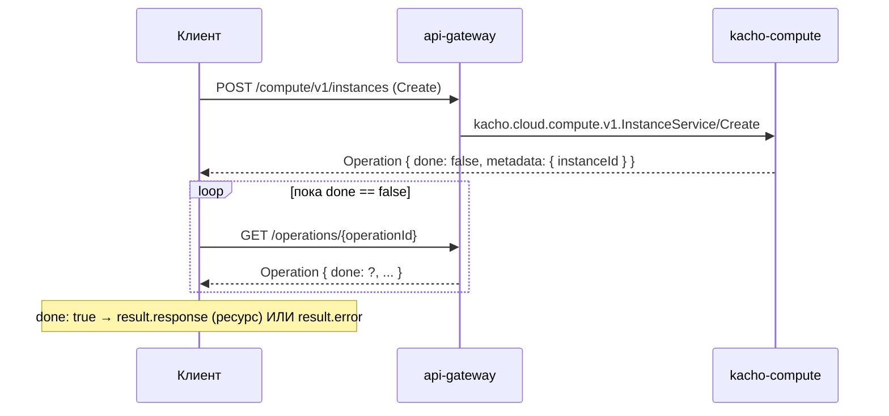

import CodeBlock from '@theme/CodeBlock'
import dedent from 'ts-dedent'

# Быстрый старт

Это пошаговый онбординг: за несколько запросов вы поднимете рабочее вычислительное
окружение в Kachō Compute — от выбора типа диска до запущенного инстанса с присоединённым
диском и снимком. Каждый шаг продолжает предыдущий: id ресурса из ответа подставляется в
следующий запрос.

Все примеры — `curl` к REST-поверхности через `api-gateway`. Та же семантика (поля, коды
ошибок, async-модель) действует и для gRPC напрямую — REST лишь проекция единого
gRPC-контракта.

:::info Что мы построим
Выбор `DiskType` → отдельный `Disk` (данные) → `Instance` (виртуальная машина с загрузочным
диском) → `AttachDisk` (подключаем диск данных) → управление жизненным циклом (`Stop` / `Start`)
→ `Snapshot` (снимок диска). К концу у вас будет запущенная ВМ с диском данных и его снимком.
:::

## Предпосылки

| Нужно | Зачем |
|---|---|
| Развёрнутый стенд Kachō (`api-gateway` + `kacho-compute` + `kacho-iam` + `kacho-geo`) | Принимает запросы и выполняет authz/валидацию |
| `projectId` существующего проекта | Все ресурсы Compute — project-level; владелец проекта живёт в kacho-iam |
| JWT-токен с правами на проект | `api-gateway` проверяет `Authorization: Bearer <token>` |
| Доступная зона (`zoneId`), напр. `region-1-a` | Инстанс и диски привязаны к зоне (валидируется через kacho-geo) |
| `curl` + `jq` (опционально) | Поллинг `Operation` и извлечение id |

Поднять стенд локально — раздел [Развёртывание](/install/deploy); параметры сервиса —
[Конфигурация](/install/configuration). Ниже предполагается, что `api-gateway` доступен на
`http://localhost:18080` (как при port-forward из dev-стенда).

:::tip Удобные переменные окружения

<CodeBlock language="bash">
  {dedent`
    export CMP=http://localhost:18080
    export TOKEN='<JWT>'
    export PROJECT='{projectId}'
    export ZONE='region-1-a'
    auth=(-H "Authorization: Bearer $TOKEN" -H 'Content-Type: application/json')
  `}
</CodeBlock>
:::

## Модель Operation: как читать ответы на мутации

Любая **мутация** (`Create` / `Update` / `Delete` и действия `Start` / `Stop` / `AttachDisk`
/ …) в Kachō Compute **асинхронна**: она не возвращает готовый ресурс, а синхронно отдаёт
`Operation` — квитанцию о принятой работе. Реальное исполнение выполняется в фоне; клиент
**поллит** `OperationService.Get(id)`, пока не увидит `done: true`.

Ответ на `Create` сразу содержит id будущего ресурса в `metadata` — но **существование
ресурса гарантировано только после `done: true`**. Когда операция завершилась, заполнено
ровно одно из полей `oneof result`:

| Поле | Значение |
|---|---|
| `response` | Успех: созданный / изменённый ресурс (для `Delete` — пустой объект) |
| `error` | Неудача: `{code, message, details}` (например, диск не READY при attach) |

Удобный шаблон поллинга:

<CodeBlock language="bash">
  {dedent`
    poll() {
      local op="$1"
      while :; do
        body=$(curl -s "$CMP/operations/$op" "\${auth[@]}")
        echo "$body" | jq -e '.done == true' >/dev/null && { echo "$body"; return; }
        sleep 2
      done
    }
  `}
</CodeBlock>

:::note Префикс id операции
Все Compute-операции имеют id с префиксом `epd` (например, `epdk3xe746h019hnz182`). По этому
префиксу `api-gateway` маршрутизирует `GET /operations/{id}` в kacho-compute.
:::

## Шаг 1. Выбрать DiskType

`DiskType` — read-only справочник доступных типов дисков. Диску при создании назначается
`typeId`; посмотрим доступные варианты:

<CodeBlock language="bash">
  {dedent`
    curl -s "$CMP/compute/v1/diskTypes" "\${auth[@]}"
  `}
</CodeBlock>

<CodeBlock language="json">
  {dedent`
    {
      "diskTypes": [
        { "id": "network-hdd", "description": "Стандартный сетевой HDD", "zoneIds": ["region-1-a", "region-1-b"] },
        { "id": "network-ssd", "description": "Сетевой SSD", "zoneIds": ["region-1-a", "region-1-b"] }
      ],
      "nextPageToken": ""
    }
  `}
</CodeBlock>

<CodeBlock language="bash">
  {dedent`
    export DTYPE=network-ssd
  `}
</CodeBlock>

## Шаг 2. Создать Disk

`Disk` — блочный диск в конкретной зоне. Создадим отдельный диск данных заданного размера
(размер — в **байтах**; здесь 8 GiB). Источник (`imageId` / `snapshotId`) не обязателен —
пустой диск создаётся без источника.

<CodeBlock language="bash">
  {dedent`
    curl -s -X POST "$CMP/compute/v1/disks" "\${auth[@]}" \\
      -d '{
        "projectId": "'"$PROJECT"'",
        "name": "data-disk",
        "typeId": "'"$DTYPE"'",
        "zoneId": "'"$ZONE"'",
        "size": 8589934592
      }'
  `}
</CodeBlock>

Ответ — `Operation` (мутация async); `metadata.diskId` — id создаваемого диска:

<CodeBlock language="json">
  {dedent`
    {
      "id": "epdk3xe746h019hnz182",
      "description": "Create disk data-disk",
      "done": false,
      "metadata": {
        "@type": "type.googleapis.com/kacho.cloud.compute.v1.CreateDiskMetadata",
        "diskId": "epd0am5d8q1w4e7r2t6y"
      }
    }
  `}
</CodeBlock>

<CodeBlock language="bash">
  {dedent`
    poll epdk3xe746h019hnz182
    export DISK=epd0am5d8q1w4e7r2t6y     # из metadata.diskId
  `}
</CodeBlock>

:::note Размер диска
Размер задаётся в байтах: от `4194304` (4 MiB) до `28587302322176` (~26 TiB) при Create.
`Update` умеет только **увеличивать** размер (и в меньшем верхнем пределе — до 4 TiB);
попытка уменьшить → `INVALID_ARGUMENT "Disk size can only be increased"`. Диск создаётся
сразу в статусе `READY` (control-plane — реальных данных нет).
:::

## Шаг 3. Создать Instance

`Instance` — виртуальная машина. При создании обязательны `platformId`, `resourcesSpec`
(cores/memory) и `bootDiskSpec` (загрузочный диск — здесь inline, из `diskSpec`). Инстанс
принадлежит зоне (`zoneId`, immutable) и проекту.

<CodeBlock language="bash">
  {dedent`
    curl -s -X POST "$CMP/compute/v1/instances" "\${auth[@]}" \\
      -d '{
        "projectId": "'"$PROJECT"'",
        "name": "web-1",
        "zoneId": "'"$ZONE"'",
        "platformId": "standard-v3",
        "resourcesSpec": { "cores": 2, "memory": 2147483648, "coreFraction": 100 },
        "bootDiskSpec": {
          "autoDelete": true,
          "diskSpec": { "typeId": "'"$DTYPE"'", "size": 10737418240 }
        }
      }'
  `}
</CodeBlock>

<CodeBlock language="bash">
  {dedent`
    poll <operationId>
    export INST=epd7t4w9e2x5h8mz0c3v   # из metadata.instanceId
  `}
</CodeBlock>

После завершения операции инстанс сразу в статусе `RUNNING` (control-plane переводит статус
детерминированно, без гипервизора).

:::note Ресурсы и платформа
`cores`, `memory`, `coreFraction` и `gpus` валидируются по таблице платформы (`platformId`):
`coreFraction ∈ {0, 5, 20, 50, 100}`, `memory ≤ 256 GiB`. Изменить `resourcesSpec` или
`platformId` можно только когда инстанс **STOPPED** — иначе `FAILED_PRECONDITION "Instance
must be stopped"`.
:::

:::caution Сетевые интерфейсы — отдельным действием
В текущем control-plane инстанс создаётся **без** сетевых интерфейсов: `Create` не провижинит
NIC автоматически. Сетевые интерфейсы (из домена kacho-vpc) подключаются отдельным действием
`AttachNetworkInterface` (требует статуса `STOPPED`). Подробнее — [Instance](/api/instance).
:::

## Шаг 4. Присоединить диск данных

Подключим созданный на шаге 2 диск к инстансу действием `:attachDisk`. Диск обязан быть
`READY`, в той же зоне и не присоединённым к другому инстансу.

<CodeBlock language="bash">
  {dedent`
    curl -s -X POST "$CMP/compute/v1/instances/$INST:attachDisk" "\${auth[@]}" \\
      -d '{
        "attachedDiskSpec": { "diskId": "'"$DISK"'", "autoDelete": false }
      }'
  `}
</CodeBlock>

<CodeBlock language="bash">
  {dedent`
    poll <operationId>
  `}
</CodeBlock>

После `done: true` `Get` инстанса покажет диск в `secondaryDisks`, а `Get` диска —
инстанс в `instanceIds`.

## Шаг 5. Управлять жизненным циклом

Инстанс проходит детерминированную state-машину. Остановим и снова запустим ВМ:

<CodeBlock language="bash">
  {dedent`
    # RUNNING → STOPPED
    curl -s -X POST "$CMP/compute/v1/instances/$INST:stop" "\${auth[@]}"
    poll <operationId>

    # STOPPED → RUNNING
    curl -s -X POST "$CMP/compute/v1/instances/$INST:start" "\${auth[@]}"
    poll <operationId>
  `}
</CodeBlock>

:::note Preconditions переходов
`Stop` требует `RUNNING`, `Start` — `STOPPED`, `Restart` — `RUNNING`. Нарушение → стабильный
`FAILED_PRECONDITION` (`"Instance is not running"` / `"Instance must be stopped"`). Полная
таблица переходов — [Жизненный цикл Instance](/architecture/instance-lifecycle).
:::

## Шаг 6. Сделать снимок диска

`Snapshot` — снимок диска, источник для восстановления или создания образа. Диск должен быть
`READY` (присоединённый диск остаётся READY, снимок можно делать не отсоединяя):

<CodeBlock language="bash">
  {dedent`
    curl -s -X POST "$CMP/compute/v1/snapshots" "\${auth[@]}" \\
      -d '{
        "projectId": "'"$PROJECT"'",
        "diskId": "'"$DISK"'",
        "name": "data-disk-snap"
      }'
  `}
</CodeBlock>

<CodeBlock language="bash">
  {dedent`
    poll <operationId>
    export SNAP=fd83v5x7z9b1d4f6h8j0   # из metadata.snapshotId
  `}
</CodeBlock>

:::note Снимок и восстановление
Из снимка можно создать новый диск — передайте `snapshotId` в `source` при `Disk.Create`.
Снимок хранит `sourceDiskId`, но жёсткого FK через границу нет: исходный диск можно удалить,
снимок останется.
:::

## Проверка результата

Все ресурсы читаются синхронно (`Get` / `List`):

<CodeBlock language="bash">
  {dedent`
    curl -s "$CMP/compute/v1/instances/$INST" "\${auth[@]}"            # инстанс + status, secondaryDisks
    curl -s "$CMP/compute/v1/disks/$DISK" "\${auth[@]}"                # диск + instanceIds
    curl -s "$CMP/compute/v1/snapshots/$SNAP" "\${auth[@]}"            # снимок + sourceDiskId
    curl -s "$CMP/compute/v1/instances?projectId=$PROJECT" "\${auth[@]}"  # все инстансы проекта
  `}
</CodeBlock>

## Уборка

Удалять нужно с учётом ссылок: присоединённый диск нельзя удалить (`RESTRICT`), поэтому
сначала — Detach (или удаление инстанса, который отвяжет диски).

<CodeBlock language="bash">
  {dedent`
    # 1) отсоединить диск данных
    curl -s -X POST "$CMP/compute/v1/instances/$INST:detachDisk" "\${auth[@]}" -d '{ "diskId": "'"$DISK"'" }'
    poll <operationId>

    # 2) удалить инстанс (загрузочный диск с autoDelete=true удалится вместе с ним)
    curl -s -X DELETE "$CMP/compute/v1/instances/$INST" "\${auth[@]}"
    poll <operationId>

    # 3) удалить снимок и диск данных (в любом порядке — жёсткого FK между ними нет)
    curl -s -X DELETE "$CMP/compute/v1/snapshots/$SNAP" "\${auth[@]}"
    curl -s -X DELETE "$CMP/compute/v1/disks/$DISK" "\${auth[@]}"
  `}
</CodeBlock>

:::caution Порядок и preconditions
Удаление — тоже async; дождитесь `done: true` каждой операции. Диск, числящийся в инстансе,
удалить нельзя — `FAILED_PRECONDITION "The disk is being used"`. `Instance.Delete` сам решает
судьбу присоединённых дисков: диски с `autoDelete=true` удаляются, остальные просто
отвязываются.
:::

## Что дальше

| Тема | Куда |
|---|---|
| Конвенции API, формат ошибок, пагинация, `:verb`-действия | [Обзор API](/api/overview) |
| Поля и методы каждого ресурса | [Instance](/api/instance) · [Disk](/api/disk) · [Image](/api/image) · [Snapshot](/api/snapshot) · [DiskType](/api/disk-type) |
| State-машина инстанса (переходы, preconditions) | [Жизненный цикл Instance](/architecture/instance-lifecycle) |
| Механика асинхронных операций (LRO) | [Операции](/api/operations) · [Операции (архитектура)](/architecture/operations) |
| Как устроен сервис внутри | [Архитектура](/architecture/overview) · [Модель данных](/architecture/data-model) |
| Авторизация и приватность | [Авторизация](/architecture/authz) |
