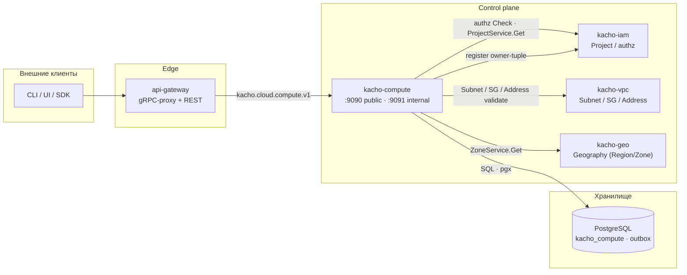
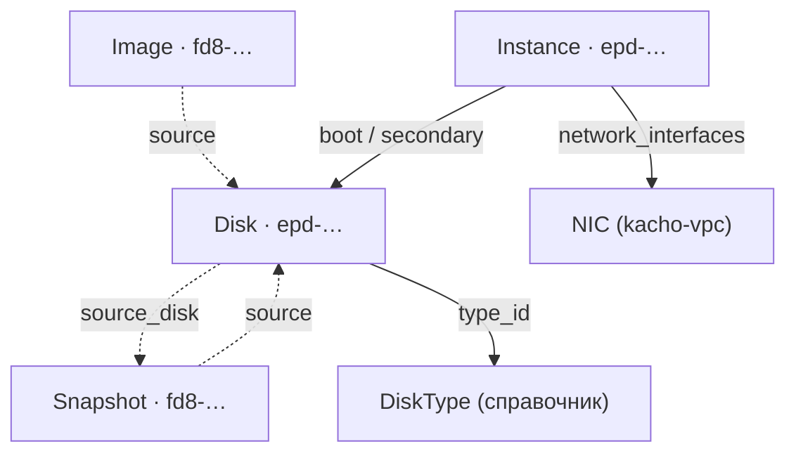

import hero from '@site/src/css/hero.module.css'

<header className={hero.hero}>
   Control-plane · Compute

  <h1 className={hero.title}>
    Вычислительные ресурсы 
    платформы Kachō
  </h1>

  

    gRPC + REST API для виртуальных машин, дисков, образов и снимков — с асинхронной
    моделью <code>Operation</code>, детерминированной state-машиной инстанса и строгой
    проверкой доступа на каждом запросе.
  

  

    <a className={hero.btnPrimary} href="/getting-started">Быстрый старт →</a>
    <a className={hero.btnGhost} href="/api/overview">Обзор API</a>
    <a className={hero.btnGhost} href="/architecture/overview">Архитектура</a>
    <a className={hero.btnGhost} href="https://github.com/PRO-Robotech/kacho-compute">GitHub</a>
  

</header>

## Что это и зачем

**Kachō Compute** — control-plane сервис, который даёт пользователю вычислительные ресурсы
как самообслуживаемый API: виртуальные машины (`Instance`), блочные диски (`Disk`), образы
(`Image`) и снимки дисков (`Snapshot`). Вместо ручного администрирования пользователь
описывает **намерение** («такой инстанс на такой платформе в такой зоне, с таким загрузочным
диском»), а сервис берёт на себя учёт состояния ресурса, переходы жизненного цикла,
валидацию ссылок на смежные домены (проект, зона, сеть) и изоляцию между проектами.

Бизнес-ценность простая: команды получают вычислительные мощности через единый API — быстро,
воспроизводимо и безопасно. Каждый ресурс принадлежит проекту (`projectId`), доступ
проверяется на каждом запросе, а целостность связей (диск присоединён к инстансу, снимок
сделан с диска) гарантируется на уровне хранилища, а не «на честном слове» клиента.

API следует **конвенциям Kachō**: плоские (flat) ресурсы, camelCase JSON, асинхронный
`Operation` на каждой мутации, REST-пути `/compute/v1/<resource>`, единый формат ошибок
`{code, message, details[]}`.

:::info Control-plane only
Kachō Compute управляет **намерением и состоянием** вычислительной конфигурации (API,
валидация, жизненный цикл, авторизация). Это control-plane: реального гипервизора нет —
статус ресурса меняется детерминированной state-машиной, содержимое диска не материализуется,
загрузка образа и вывод serial-порта синтетические. Эта документация описывает control-plane API.
:::

:::tip С чего начать
Новому пользователю — [**Быстрый старт**](/getting-started): пошагово от нуля до запущенного
инстанса (Disk → Image → Instance → Attach/Start/Stop) с реальными `curl`-примерами. Готовы к
деталям — [Обзор API](/api/overview) и [Архитектура](/architecture/overview).
:::

## Ключевые возможности

  

    ⇄
    gRPC + REST API
    Единый контракт на Protocol Buffers (<code>kacho-proto</code>), REST-проекция через grpc-gateway.
  

  

    ⏱
    Async Operations (LRO)
    Все мутации возвращают <code>Operation</code>; клиент поллит <code>OperationService.Get(id)</code> до <code>done=true</code>.
  

  

    ▷
    Жизненный цикл Instance
    Детерминированная state-машина: Start / Stop / Restart / Update с явными preconditions.
  

  

    ▤
    Диски и снимки
    Attach/Detach дисков, снимки (Snapshot) и образы (Image) как источники создания дисков.
  

  

    ◈
    Многозональность
    Ресурсы привязаны к зонам; <code>zoneId</code> валидируется через домен Geography (kacho-geo).
  

  

    🔑
    Авторизация OpenFGA
    Per-RPC authz-гейт через kacho-iam (ReBAC; relation-based на ресурсах/проектах).
  

  

    ◉
    Целостность на уровне БД
    FK / partial-UNIQUE / атомарный CAS в PostgreSQL — инварианты не «на честном слове».
  

  

    ▦
    PostgreSQL + outbox
    Хранилище <code>kacho_compute</code>; transactional outbox + LISTEN/NOTIFY для событий.
  

## Архитектура

Kachō Compute — один из доменных сервисов платформы. Tenant-запросы проходят через
`api-gateway`; peer-сервисы (kacho-iam, kacho-vpc, kacho-geo) зовутся напрямую с
request-path для валидации ссылок.

Система построена по принципу **database-per-service**: kacho-compute владеет схемой
`kacho_compute` и общается с другими доменами только по API (никаких cross-service FK).
Подробнее — [Архитектура](/architecture/overview).

## Доменная модель

Kachō Compute управляет **четырьмя мутируемыми ресурсами** (Instance / Disk / Image /
Snapshot) и одним **read-only справочником** (`DiskType`). Все ресурсы — «плоские» (flat):
domain-поля на верхнем уровне сообщения, без K8s-envelope.

<table>
  <thead>
    <tr><th>Ресурс</th><th>ID-префикс</th><th>Описание</th></tr>
  </thead>
  <tbody>
    <tr><td><strong>Instance</strong></td><td><code>epd</code></td><td>Виртуальная машина: платформа, ресурсы (cores/memory), диски, сетевые интерфейсы, state-машина</td></tr>
    <tr><td><strong>Disk</strong></td><td><code>epd</code></td><td>Блочный диск: тип, зона, размер; источник — образ или снимок</td></tr>
    <tr><td><strong>Image</strong></td><td><code>fd8</code></td><td>Образ для создания загрузочных дисков; источник — образ / диск / снимок / URI</td></tr>
    <tr><td><strong>Snapshot</strong></td><td><code>fd8</code></td><td>Снимок диска — источник для восстановления или создания образа</td></tr>
    <tr><td><strong>DiskType</strong></td><td>—</td><td><em>(read-only справочник)</em> Тип диска (<code>network-ssd</code>, …); id — литерал</td></tr>
  </tbody>
</table>

:::note ID-формат
Каждый id — 3-символьный префикс ресурса + 17 символов crockford-base32 (`kacho-corelib/ids`).
Instance и Disk делят префикс `epd`; Image и Snapshot — `fd8` (группировка по доменному
префиксу). `DiskType` идентифицируется человекочитаемым литералом (`network-ssd`), а не
сгенерированным id. Все compute-`Operation` также получают префикс `epd` — по нему api-gateway
маршрутизирует `OperationService.Get`.
:::

### Связи ресурсов

:::tip Порядок удаления
Присоединённый диск нельзя удалить, пока он числится в инстансе
(`FAILED_PRECONDITION "The disk is being used"`, FK `ON DELETE RESTRICT`). Сначала — Detach
диска (или удаление инстанса), затем — удаление самого диска. Образы и снимки можно удалять
независимо: диск хранит id источника, но жёсткого FK через границу нет.
:::

## API-операции

Каждый мутируемый ресурс поддерживает базовый набор операций (часть — ресурс-специфична):

<table>
  <thead><tr><th>Операция</th><th>Тип</th><th>Описание</th></tr></thead>
  <tbody>
    <tr><td><code>Get</code></td><td>sync</td><td>Получить ресурс по id</td></tr>
    <tr><td><code>List</code></td><td>sync</td><td>Список проекта с фильтром (<code>name="..."</code>) и cursor-пагинацией</td></tr>
    <tr><td><code>Create</code></td><td><strong>async → Operation</strong></td><td>Создание ресурса</td></tr>
    <tr><td><code>Update</code></td><td><strong>async → Operation</strong></td><td>Изменение (с <code>updateMask</code>)</td></tr>
    <tr><td><code>Delete</code></td><td><strong>async → Operation</strong></td><td>Удаление (hard-delete)</td></tr>
  </tbody>
</table>

`Instance` дополнительно несёт lifecycle- и attach-действия (`Start`, `Stop`, `Restart`,
`AttachDisk`, `DetachDisk`, `UpdateMetadata`, `AttachNetworkInterface` и др.) — полный список
на [странице Instance](/api/instance). `DiskType` доступен только на чтение (`Get` / `List`);
управление справочником — admin-функция на internal-порту.

Подробнее о механике LRO — [Операции (Operations)](/architecture/operations). Сквозной
практический пример — [Быстрый старт](/getting-started).

## Технологический стек

<table>
  <thead><tr><th>Технология</th><th>Применение</th></tr></thead>
  <tbody>
    <tr><td>Go</td><td>Язык реализации</td></tr>
    <tr><td>Protocol Buffers / Buf</td><td>Контракт API (<code>kacho-proto</code>), кодогенерация</td></tr>
    <tr><td>PostgreSQL / pgx v5</td><td>Хранилище <code>kacho_compute</code></td></tr>
    <tr><td>Goose</td><td>Версионирование схемы (<code>0001</code> — squashed baseline)</td></tr>
    <tr><td>sqlc + handwritten pgx</td><td>SQL-доступ (без ORM)</td></tr>
    <tr><td>OpenFGA (ReBAC)</td><td>Авторизация — relation-based на ресурсах/проектах</td></tr>
    <tr><td>grpc-gateway</td><td>REST-проекция gRPC</td></tr>
  </tbody>
</table>

## Структура репозиториев

<table>
  <thead><tr><th>Репозиторий</th><th>Назначение</th></tr></thead>
  <tbody>
    <tr><td><strong>kacho-compute</strong></td><td>Этот сервис: control-plane Compute</td></tr>
    <tr><td><strong>kacho-proto</strong></td><td>Центральные <code>.proto</code> + сгенерированные Go-stubs</td></tr>
    <tr><td><strong>kacho-corelib</strong></td><td>Общие пакеты (ids, operations, db, outbox, ...)</td></tr>
    <tr><td><strong>kacho-api-gateway</strong></td><td>Edge: gRPC-proxy + REST mux</td></tr>
    <tr><td><strong>kacho-iam</strong></td><td>Account / Project / авторизация (per-RPC Check)</td></tr>
    <tr><td><strong>kacho-vpc</strong></td><td>Subnet / SecurityGroup / Address (валидация NIC-spec)</td></tr>
    <tr><td><strong>kacho-geo</strong></td><td>Geography (Region / Zone) — валидация <code>zoneId</code></td></tr>
  </tbody>
</table>
