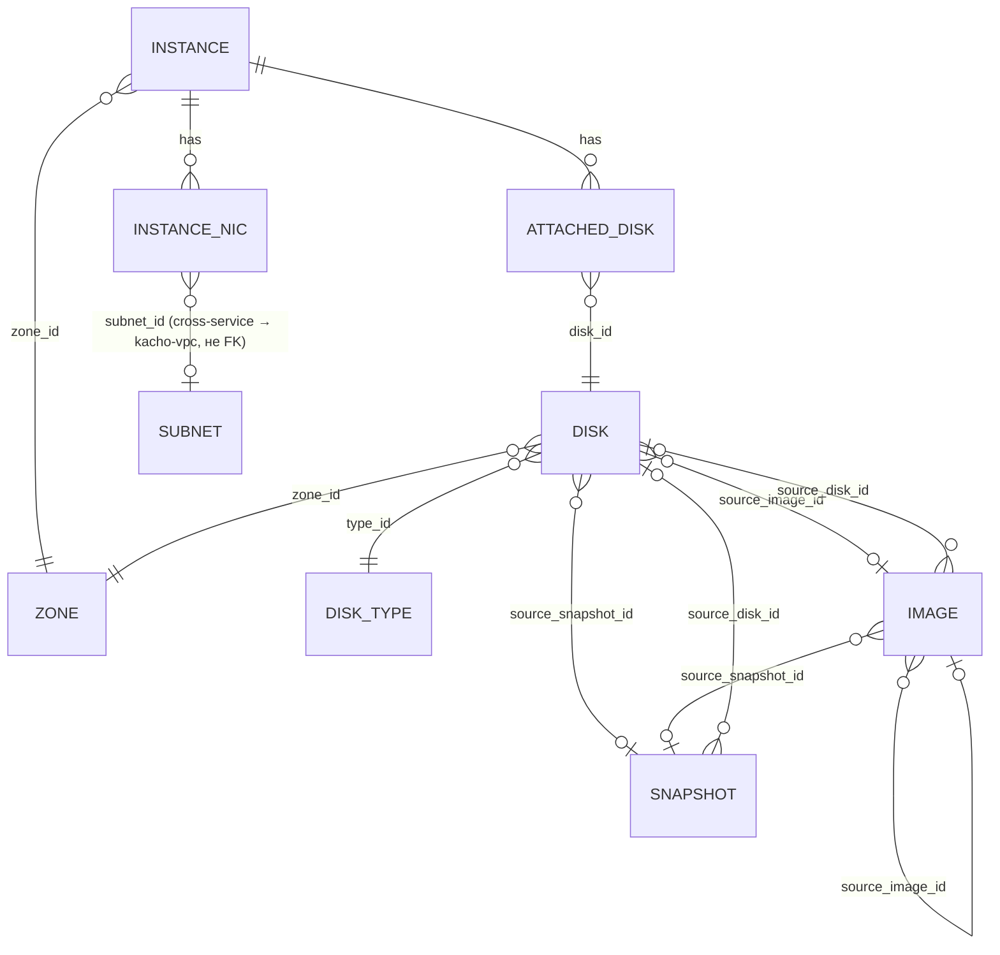

# 01 — Resources

Детально по каждому ресурсу: proto-поля, ID-префикс, status-enum, **полный**
список RPC (из `*_service.proto`) с пометкой реализован / `blocked:*` /
`Unimplemented`, ключевые инварианты, cross-resource links.

## Иерархия и связи



Текстовая модель:

```
                ┌──────────── Image ◄─────┐ (source: image|snapshot|disk|uri)
Instance (1) ───┤                          │
   │            └─ boot_disk / secondary_disks (N) ──→ Disk (N)
   │                                                     │
   │  attached_disk: instance ↔ disk (M:N через          │ (source: image|snapshot)
   │  attached_disks таблицу; auto_delete / is_boot)      ▼
   ├─ network_interfaces[] (N): subnet_id, primary_v4_address,    Snapshot (N)
   │     {one_to_one_nat: address}, security_group_ids[]          source_disk_id
   ├─ filesystem_specs[] → blocked:kacho-filesystem
   └─ status: state-машина (см. 03-instance-lifecycle.md)

Disk       — zone-level, type_id → DiskType, может иметь source = image|snapshot
Image      — folder-level, family (GetLatestByFamily), source = image|snapshot|disk|uri
Snapshot   — folder-level, source_disk_id (обязателен в Create)
DiskType   — глобальный read-only справочник (id = "network-ssd" и т.п.)
Region/Zone — публичный read-only справочник Geography (owner = kacho-compute, эпик KAC-15)
```

Все мутируемые ресурсы (Instance/Disk/Image/Snapshot) — **folder-level**
(`folder_id` обязателен в Create). Все таблицы **flat** (без K8s envelope
`resource_version`/`generation`/`deletion_timestamp`/`finalizers`/`spec`/`status`
как JSONB). `cloud_id`/`organization_id` в схеме отсутствуют — фильтрация только
по `folder_id` (как в VPC). Колонки `id` — `TEXT` (не UUID).

## Resource ID format

ID получают через `kacho-corelib/ids.NewID(<prefix>)` — 3 символа + 17-char
crockford-base32 (всего 20). Источник истины — `kacho-corelib/ids/ids.go`:

| Ресурс           | Prefix const                                              | Значение | Пример              |
|------------------|-----------------------------------------------------------|----------|---------------------|
| Instance         | `ids.PrefixInstance`                                      | `epd`    | `epd + 17 base32`   |
| Disk             | `ids.PrefixDisk`                                          | `epd`    | `epd + ...`         |
| Image            | `ids.PrefixImage`                                         | `fd8`    | `fd8 + ...`         |
| Snapshot         | `ids.PrefixSnapshot`                                      | `fd8`    | `fd8 + ...`         |
| Operation (CMP)  | `ids.PrefixOperationCompute` (== `ids.PrefixInstance`)    | `epd`    | `epd + ...`         |
| DiskType         | литерал-строка (`network-ssd` и т.п.)                     | —        | не prefix-id        |
| Zone             | литерал-строка (`ru-central1-a` и т.п.)                   | —        | не prefix-id        |

⚠️ Instance/Disk **делят `epd`**; Image/Snapshot **делят `fd8`** — умышленно
(зеркалит VPC где Network/RT/SG/GW/PE делят `enp`, Subnet/Address делят `e9b`).
**Все compute-операции** независимо от ресурса получают prefix `epd`
(`PrefixOperationCompute == PrefixInstance`) — api-gateway opsproxy маршрутизирует
`OperationService.Get(id)` по первым 3 символам, поэтому все операции домена
должны идти в один backend. `ImageService.Create` вернёт operation с id `epd...`,
внутри которого `response` = Image с id `fd8...` (как в VPC `SubnetService.Create`
→ op `enp...`, внутри Subnet `e9b...`).

**Не валидировать id-формат sync** на входе RPC (`(length) = "<=50"` из proto —
max-длина, не format): verbatim YC — well-formed-но-несуществующий id даёт
async `NotFound`, а malformed/wrong-prefix id → sync `InvalidArgument "invalid
<res> id '<X>'"` (probe 2026-05-11), у нас пока ловится на DB-уровне → `NotFound`
— расхождение, см. [`07-known-divergences.md`](07-known-divergences.md) §1.

---

## Disk

Том. Zone-level (`zone_id` обязателен), `type_id` → DiskType, может иметь
`source` = image | snapshot. Таблица `disks`.

### proto-поля (`disk.proto`, message `Disk`)

| Поле | Тип | Замечания |
|---|---|---|
| `id` | string | prefix `epd` |
| `folder_id` | string | partial UNIQUE `(folder_id, name) WHERE name <> ''` |
| `created_at` | Timestamp | truncate до секунд в proto-ответе |
| `name` | string | 1-63 chars, proto `(pattern) = "\|[a-z]([-_a-z0-9]{0,61}[a-z0-9])?"` — lowercase only, empty allowed → `corevalidate.NameCompute` |
| `description` | string | ≤256 |
| `labels` | map<string,string> | ≤64 пар, key regex `[a-z][-_./\@0-9a-z]*` |
| `type_id` | string | ссылка на DiskType; пуст → default `network-ssd` |
| `zone_id` | string | required; existence через `ZoneRegistry` — локальная таблица `zones` (kacho-compute owns Geography, эпик `KAC-15`; больше не proxy в kacho-vpc) |
| `size` | int64 | в байтах; Create `[4194304 .. 28587302322176]`, Update `[4194304 .. 4398046511104]` (из proto `(value)`) |
| `block_size` | int64 | default 4096; whitelist {4096, ...} (probe YC точный set) |
| `product_ids` | repeated string | license IDs; в control-plane статичны |
| `status` | Disk.Status enum | `STATUS_UNSPECIFIED=0, CREATING=1, READY=2, ERROR=3, DELETING=4` |
| `source` oneof | `source_image_id` / `source_snapshot_id` | НЕ FK (Image/Snapshot можно удалить, оставив Disk) |
| `instance_ids` | repeated string | вычисляется из `attached_disks` (output-only) |
| `disk_placement_policy` | DiskPlacementPolicy | `{placement_group_id, placement_group_partition}` — хранится, реальный placement-group не реализован |
| `hardware_generation` | HardwareGeneration | nullable |
| `kms_key` | KMSKey | `blocked:kacho-kms` |

### RPC (`disk_service.proto`, service `DiskService`)

| RPC | sync/async | статус | примечание |
|---|---|---|---|
| `Get` | sync | ✅ | `GET /compute/v1/disks/{disk_id}` |
| `List` | sync | ✅ | `GET /compute/v1/disks?folderId=` ; filter `name=` ; cursor pagination |
| `Create` | async | ✅ | op metadata `CreateDiskMetadata{disk_id}`, response `Disk`. Поля `snapshot_schedule_ids` → `blocked:kacho-snapshot-schedule` (отвергается / игнорируется); `kms_key_id` → `blocked:kacho-kms` |
| `Update` | async | ✅ | metadata `UpdateDiskMetadata`, response `Disk`. mutable: `name`/`description`/`labels`/`size` (только увеличение)/`disk_placement_policy`; immutable: `type_id`/`zone_id`/`block_size`/`source` |
| `Delete` | async | ✅ | metadata `DeleteDiskMetadata`, response `google.protobuf.Empty`. Attached disk → `FailedPrecondition "The disk <id> is being used"` (FK `attached_disks.disk_id` RESTRICT) |
| `ListOperations` | sync | ✅ | `GET /compute/v1/disks/{disk_id}/operations` |
| `Relocate` | async | ⚠️ частично | metadata `RelocateDiskMetadata`, response `Disk`. Меняет `zone_id`; precondition: disk не attached (`FailedPrecondition "Disk is in use"`). Cross-zone semantics simplified — см. `07-known-divergences.md` §7 |
| `ListSnapshotSchedules` | sync | 🚫 `blocked:kacho-snapshot-schedule` | возвращает пустой list / `Unimplemented` — нет ресурса SnapshotSchedule |
| `ListAccessBindings` | sync | ⏭️ no-op скелет | пустой list (AAA не реализован) |
| `SetAccessBindings` | async | ⏭️ no-op скелет | operation сразу done, response `access.AccessBindingsOperationResult{}` |
| `UpdateAccessBindings` | async | ⏭️ no-op скелет | то же |

### Инварианты

- `Create` со ссылкой `image_id` → size ≥ `image.min_disk_size`, иначе
  `InvalidArgument` (текст probe). `snapshot_id` → size ≥ `snapshot.disk_size`.
- `source` (image_id/snapshot_id) — existence-check в той же БД в worker'е →
  `NotFound`; источник может быть удалён позже (не FK).
- `Status` всегда `READY` после Create (control-plane: insert сразу READY).
- `size` в Update — только увеличение; уменьшение → `InvalidArgument "Disk size
  can only be increased"` (текст probe). Верхняя граница в Update меньше, чем в
  Create (4 TiB vs 28 TiB — из proto `(value)`).
- `instance_ids` — derived из `attached_disks`, не хранится отдельно.

---

## Image

Образ. Folder-level, `family` для `GetLatestByFamily`, `source` =
image | snapshot | disk | uri. Таблица `images`.

### proto-поля (`image.proto`, message `Image`)

| Поле | Тип | Замечания |
|---|---|---|
| `id` | string | prefix `fd8` |
| `folder_id` | string | partial UNIQUE `(folder_id, name) WHERE name <> ''` |
| `created_at` | Timestamp | truncate до секунд |
| `name`, `description`, `labels` | | как у Disk |
| `family` | string | proto `(pattern) = "\|[a-z][-a-z0-9]{1,61}[a-z0-9]"`; индекс `images_family_idx (folder_id, family, created_at DESC)` для GetLatestByFamily |
| `storage_size` | int64 | размер образа (delta) |
| `min_disk_size` | int64 | мин. размер диска из этого образа; Create/Update `[4194304 .. 4398046511104]` |
| `product_ids` | repeated string | license IDs (`os_product_ids` в Create → `blocked:kacho-marketplace`) |
| `status` | Image.Status enum | `STATUS_UNSPECIFIED=0, CREATING=1, READY=2, ERROR=3, DELETING=4` |
| `os` | Os{type: LINUX\|WINDOWS, nvidia.driver} | в схеме: `os_type`, `os_nvidia_driver` |
| `pooled` | bool | indicates fast-create pool (хранится, реального pool нет) |
| `hardware_generation` | HardwareGeneration | nullable |
| `kms_key` | KMSKey | `blocked:kacho-kms` |

В схеме `images` также хранится происхождение (для observability, не FK):
`source_image_id`, `source_snapshot_id`, `source_disk_id`, `source_uri`.

### RPC (`image_service.proto`, service `ImageService`)

| RPC | sync/async | статус | примечание |
|---|---|---|---|
| `Get` | sync | ✅ | `GET /compute/v1/images/{image_id}` |
| `GetLatestByFamily` | sync | ✅ | `GET /compute/v1/images:latestByFamily?folderId=&family=` — самый свежий по `created_at DESC` |
| `List` | sync | ✅ | `GET /compute/v1/images?folderId=` |
| `Create` | async | ✅ | metadata `CreateImageMetadata{image_id}`, response `Image`. `oneof source` (`exactly_one`): `image_id` / `disk_id` / `snapshot_id` / `uri` (download мгновенный, статус сразу READY); `os_product_ids` → `blocked:kacho-marketplace` |
| `Update` | async | ✅ | metadata `UpdateImageMetadata`, response `Image`. mutable: `name`/`description`/`labels`/`min_disk_size`; immutable: `family`/`os`/`product_ids`/`pooled`/`hardware_generation` |
| `Delete` | async | ✅ | metadata `DeleteImageMetadata`, response `Empty`. Удаление образа не удаляет дисков, созданных из него (не FK) |
| `ListOperations` | sync | ✅ | `GET /compute/v1/images/{image_id}/operations` |
| `ListAccessBindings` / `SetAccessBindings` / `UpdateAccessBindings` | — | ⏭️ no-op скелет | как у Disk |

### Инварианты

- `Create`: ровно один из `source` (proto `(exactly_one)`); нарушение →
  `InvalidArgument`. Если `image_id`/`disk_id`/`snapshot_id` — existence-check в
  той же БД → `NotFound`. `uri`-source — control-plane заглушка: download
  мгновенный, статус сразу `READY`.
- `min_disk_size` immutable-семантика как в YC: при изменении в большую сторону
  допустимо; constraint-текст probe — `07-known-divergences.md` §4.
- `GetLatestByFamily` — `WHERE folder_id=$1 AND family=$2 ORDER BY created_at
  DESC LIMIT 1`; нет ни одного → `NotFound`.

---

## Snapshot

Снимок диска. Folder-level, `source_disk_id` обязателен в Create. Таблица
`snapshots`.

### proto-поля (`snapshot.proto`, message `Snapshot`)

| Поле | Тип | Замечания |
|---|---|---|
| `id` | string | prefix `fd8` |
| `folder_id` | string | partial UNIQUE `(folder_id, name) WHERE name <> ''` |
| `created_at` | Timestamp | truncate до секунд |
| `name`, `description`, `labels` | | как у Disk |
| `storage_size` | int64 | delta от предыдущего снимка того же диска |
| `disk_size` | int64 | размер диска в момент создания снимка |
| `product_ids` | repeated string | license IDs |
| `status` | Snapshot.Status enum | `STATUS_UNSPECIFIED=0, CREATING=1, READY=2, ERROR=3, DELETING=4` |
| `source_disk_id` | string | НЕ FK (source disk можно удалить, оставив snapshot); индекс `snapshots_source_disk_idx` |
| `hardware_generation` | HardwareGeneration | nullable |
| `kms_key` | KMSKey | `blocked:kacho-kms` |

### RPC (`snapshot_service.proto`, service `SnapshotService`)

| RPC | sync/async | статус | примечание |
|---|---|---|---|
| `Get` | sync | ✅ | `GET /compute/v1/snapshots/{snapshot_id}` |
| `List` | sync | ✅ | `GET /compute/v1/snapshots?folderId=` |
| `Create` | async | ✅ | required `disk_id`; metadata `CreateSnapshotMetadata{snapshot_id, disk_id}`, response `Snapshot`. Disk должен существовать и быть `READY` |
| `Update` | async | ✅ | metadata `UpdateSnapshotMetadata`, response `Snapshot`. mutable: `name`/`description`/`labels`; immutable: `source_disk_id`/`disk_size`/`storage_size` |
| `Delete` | async | ✅ | metadata `DeleteSnapshotMetadata`, response `Empty` |
| `ListOperations` | sync | ✅ | `GET /compute/v1/snapshots/{snapshot_id}/operations` |
| `ListAccessBindings` / `SetAccessBindings` / `UpdateAccessBindings` | — | ⏭️ no-op скелет | как у Disk |

### Инварианты

- `Create` требует `disk_id` (sync required); диск должен существовать
  (existence-check в той же БД → `NotFound`) и быть в `READY`
  (`FailedPrecondition` — текст probe). `disk_size` снапшота = текущий
  `disks.size`; `source_disk_id` сохраняется (не FK).
- `Status` всегда `READY` после Create (control-plane).

---

## Instance

Виртуальная машина. Folder-level (`folder_id`), zone-level (`zone_id`), привязан
к платформе (`platform_id`), имеет boot-disk + secondary-disks (через
`attached_disks`), N сетевых интерфейсов (через `instance_network_interfaces`),
state-машину статуса. Таблица `instances` + дочерние `instance_network_interfaces`
(CASCADE) + `attached_disks`.

### proto-поля (`instance.proto`, message `Instance`)

| Поле | Тип | Замечания |
|---|---|---|
| `id` | string | prefix `epd` |
| `folder_id` | string | partial UNIQUE `(folder_id, name) WHERE name <> ''` |
| `created_at` | Timestamp | truncate до секунд |
| `name`, `description`, `labels` | | как у Disk |
| `zone_id` | string | required; existence через `ZoneRegistry` (локальная таблица `zones`, эпик `KAC-15`); immutable (меняется через Relocate) |
| `platform_id` | string | required (`standard-v1/v2/v3`, `highfreq-v3`, `gpu-*` — таблица в `internal/service/platforms.go`) |
| `resources` | Resources{memory, cores, core_fraction, gpus} | в схеме: `cores`, `memory`, `core_fraction`, `gpus`. proto `ResourcesSpec`: `memory ≤ 274877906944`, `cores ∈ {2,4,...,80}`, `core_fraction ∈ {0,5,20,50,100}`, `gpus ∈ {0,1,2,4}` + per-platform валидация |
| `status` | Instance.Status enum | `STATUS_UNSPECIFIED=0, PROVISIONING=1, RUNNING=2, STOPPING=3, STOPPED=4, STARTING=5, RESTARTING=6, UPDATING=7, ERROR=8, CRASHED=9, DELETING=10`. Подробно — [`03-instance-lifecycle.md`](03-instance-lifecycle.md) |
| `metadata` | map<string,string> | суммарно ≤ 256 KiB (proto: "less than 512 KB" суммарно ключей+значений, каждое значение ≤ 256 KB); меняется только через `UpdateMetadata` RPC. **Омитится из ответа List** (verbatim YC) |
| `metadata_options` | MetadataOptions | nullable |
| `boot_disk` | AttachedDisk{mode, device_name, auto_delete, disk_id} | derived: строка в `attached_disks` с `is_boot=true`; immutable |
| `secondary_disks` | repeated AttachedDisk | derived из `attached_disks` `is_boot=false`; до 3 при Create (proto `(size) = "<=3"`) |
| `local_disks` | repeated AttachedLocalDisk | proto-поле есть; реализация отложена |
| `filesystems` | repeated AttachedFilesystem | `blocked:kacho-filesystem` |
| `network_interfaces` | repeated NetworkInterface{index, mac_address, subnet_id, primary_v4_address{address, one_to_one_nat{address, ip_version, dns_records}, dns_records}, security_group_ids[], `nic_id`} | строки `instance_network_interfaces`. `nic_id` (proto field 7) — id ресурса **kacho-vpc `NetworkInterface`**, бэкующего этот интерфейс; он source of truth (адрес, SG, data-plane), а `subnet_id`/`primary_v4_address` — read-only denorm-зеркало (epic KAC-9, см. ниже «Instance ↔ kacho-vpc NetworkInterface») |
| `serial_port_settings` | SerialPortSettings{ssh_authorization} | nullable |
| `gpu_settings` | GpuSettings{gpu_cluster_id} | `gpu_cluster_id` хранится; реального GpuCluster нет |
| `fqdn` | string | output-only; вычисляется при Create: `<hostname>.<region_id>.internal` или `<id>.auto.internal` (если hostname не задан) |
| `scheduling_policy` | SchedulingPolicy{preemptible} | в схеме: `scheduling_preemptible` |
| `service_account_id` | string | хранится; реального IAM нет |
| `network_settings` | NetworkSettings{type: STANDARD\|SOFTWARE_ACCELERATED\|HARDWARE_ACCELERATED} | в схеме: `network_settings_type` (default `STANDARD`) |
| `placement_policy` | PlacementPolicy{placement_group_id, host_affinity_rules[], placement_group_partition} | хранится; реального placement-group нет |
| `host_group_id` / `host_id` | string | хранятся; реальных host-group/host нет |
| `maintenance_policy` | MaintenancePolicy{RESTART\|MIGRATE} | в схеме: `maintenance_policy` (имя enum-значения) |
| `maintenance_grace_period` | Duration | в схеме: `maintenance_grace_period_seconds`; proto `(value) = "1s-24h"` в Create/Update |
| `hardware_generation` | HardwareGeneration | inherited от boot-image/disk; nullable |
| `reserved_instance_pool_id` | string | хранится; реального ReservedInstancePool нет |
| `application` | Application{container_solution, cloudbackup} | хранится; не интерпретируется |

(`hostname` из `CreateInstanceRequest` хранится в `instances.hostname` для
вычисления `fqdn` и не возвращается отдельным полем в `Instance`.)

### RPC (`instance_service.proto`, service `InstanceService`)

| RPC | sync/async | статус | примечание |
|---|---|---|---|
| `Get` | sync | ✅ | `GET /compute/v1/instances/{instance_id}?view=` (BASIC/FULL — FULL включает metadata) |
| `List` | sync | ✅ | `GET /compute/v1/instances?folderId=`. metadata всегда омитится (verbatim YC). filter: `id/name/created_at/status/zone_id/platform_id/host_id` (whitelist; текущая фаза — `name=`) |
| `Create` | async | ✅ | required `zone_id`/`platform_id`/`resources_spec`/`boot_disk_spec`. metadata `CreateInstanceMetadata{instance_id}`, response `Instance`. boot/secondary disk: `exactly_one` of {`disk_id`, `disk_spec`}. ⚠️ **без авто-NIC** — auto-NIC материализация `materializeNICs` удалена в `KAC-266`: инстанс создаётся **без сетевых интерфейсов** (`instance_network_interfaces` пуст), NIC не создаётся/привязывается на Create; правильная сетевая модель (явная привязка NIC) — будущая переделка. end status `RUNNING`. `filesystem_specs[]` → `blocked:kacho-filesystem`; `local_disk_specs[]` — отложено |
| `Update` | async | ✅ | metadata `UpdateInstanceMetadata`, response `Instance`. mutable: `name`/`description`/`labels`/`service_account_id`/`network_settings`/`placement_policy`/`scheduling_policy`/`maintenance_policy`/`maintenance_grace_period`/`serial_port_settings`. `resources_spec`/`platform_id` — только при `STOPPED` (`FailedPrecondition "Instance must be stopped"`). `metadata` — через `UpdateMetadata`. immutable: `zone_id`/`boot_disk` |
| `Delete` | async | ✅ | metadata `DeleteInstanceMetadata`, response `Empty`. worker: обрабатывает attached disks по `auto_delete` (true → DELETE disk; false → строка `attached_disks` чистится CASCADE при DELETE instance), для каждого NIC с непустым `nic_id` — delete kacho-vpc `NetworkInterface` (release его Address-ресурсов; best-effort vpcClient), DELETE instance (CASCADE чистит NIC-строки + attached_disks), освобождает one_to_one_nat addresses (best-effort vpcClient) |
| `UpdateMetadata` | async | ✅ | `POST /compute/v1/instances/{instance_id}/updateMetadata` body `{delete:[], upsert:{}}`. metadata `UpdateInstanceMetadataMetadata`, response `Instance`. status unchanged |
| `GetSerialPortOutput` | **sync** | ✅ (синтетика) | `GET /compute/v1/instances/{instance_id}:serialPortOutput?port=1..4`. response `GetInstanceSerialPortOutputResponse{contents}` — синтетический текст (НЕ операция) |
| `Stop` | async | ✅ | `POST /compute/v1/instances/{instance_id}:stop`. precondition `status ∈ {RUNNING}` → end `STOPPED`. metadata `StopInstanceMetadata`, response `Empty` |
| `Start` | async | ✅ | precondition `status ∈ {STOPPED}` → end `RUNNING`. metadata `StartInstanceMetadata`, response `Instance` |
| `Restart` | async | ✅ | precondition `status ∈ {RUNNING}` → end `RUNNING`. metadata `RestartInstanceMetadata`, response `Empty` |
| `AttachDisk` | async | ✅ | `POST :attachDisk` body `{attached_disk_spec}`. precondition `status ∈ {RUNNING, STOPPED}`; disk READY & same zone & not attached. metadata `AttachInstanceDiskMetadata{instance_id, disk_id}`, response `Instance`. status unchanged |
| `DetachDisk` | async | ✅ | `POST :detachDisk` body `oneof {disk_id, device_name}` (`exactly_one`). precondition `status ∈ {RUNNING, STOPPED}`; disk attached & not boot. metadata `DetachInstanceDiskMetadata`, response `Instance` |
| `AddOneToOneNat` | async | ✅ | `POST /addOneToOneNat` body `{network_interface_index, internal_address?, one_to_one_nat_spec?}`. precondition `status ∈ {RUNNING, STOPPED}`; NIC index valid. metadata `AddInstanceOneToOneNatMetadata`, response `Instance` |
| `RemoveOneToOneNat` | async | ✅ | `POST /removeOneToOneNat` body `{network_interface_index, internal_address?}`. precondition как у Add. metadata `RemoveInstanceOneToOneNatMetadata`, response `Instance` |
| `UpdateNetworkInterface` | async | ✅ | `PATCH /updateNetworkInterface` body `{network_interface_index, update_mask, subnet_id?, primary_v4_address_spec?, primary_v6_address_spec?, security_group_ids?}`. metadata `UpdateInstanceNetworkInterfaceMetadata`, response `Instance`. OCC через `xmin` (read-modify-write). Precondition-семантика probe YC |
| `AttachNetworkInterface` | async | ✅ | `POST :attachNetworkInterface` body `{network_interface_index, subnet_id, primary_v4_address_spec?, security_group_ids[]}`. proto: instance должен быть `STOPPED`. metadata `AttachInstanceNetworkInterfaceMetadata`, response `Instance` |
| `DetachNetworkInterface` | async | ✅ | `POST :detachNetworkInterface` body `{network_interface_index}`. proto: instance `STOPPED`. metadata `DetachInstanceNetworkInterfaceMetadata`, response `Instance` |
| `ListOperations` | sync | ✅ | `GET /compute/v1/instances/{instance_id}/operations` |
| `Relocate` | async | 🚫 blocked | `POST :relocate` body `{destination_zone_id, network_interface_specs[1], boot_disk_placement?, secondary_disk_placements[]}`. metadata `RelocateInstanceMetadata`, response `Instance`. Нужен cross-zone disk move + restart-семантика → `Unimplemented` / частично |
| `SimulateMaintenanceEvent` | async | ⏭️ no-op | `POST :simulateMaintenanceEvent`. metadata `SimulateInstanceMaintenanceEventMetadata`, response `Empty`. operation сразу done |
| `ListAccessBindings` / `SetAccessBindings` / `UpdateAccessBindings` | — | ⏭️ no-op скелет | как у Disk |

### Инварианты

- `Create`: ⚠️ **без авто-NIC** — auto-NIC материализация (`materializeNICs`)
  удалена в `KAC-266`: per-NIC валидация (subnet/SG/NAT-address) и создание
  kacho-vpc `NetworkInterface` больше не выполняются, инстанс создаётся без
  сетевых интерфейсов; правильная сетевая модель — будущая переделка. boot disk:
  `disk_id` → existence-check; `disk_spec` → inline-создание Disk в той же TX.
  Insert instance + attached_disks в **одной транзакции** worker'а, затем outbox
  `Instance CREATED`.
- Ровно один boot-disk (`attached_disks_boot_uniq` partial UNIQUE на
  `instance_id WHERE is_boot`). `device_name` уникален в пределах instance
  (`attached_disks_device_uniq` partial UNIQUE на `(instance_id, device_name)
  WHERE device_name <> ''`).
- `resources_spec` валидируется per-platform (`internal/service/platforms.go`):
  `cores` per-platform set, `memory` кратно GB и в range, `core_fraction ∈
  {0,5,20,50,100}`, `gpus` per-platform.
- `status_message` поле — всегда пусто (control-plane).
- State-машина статуса — [`03-instance-lifecycle.md`](03-instance-lifecycle.md).

### Cross-resource links

- `boot_disk` / `secondary_disks` → `attached_disks` → `disks` (FK `disk_id`
  RESTRICT — нельзя удалить Disk пока attached; FK `instance_id` CASCADE).
- `instances.boot_disk_id` — не отдельный FK, а строка `attached_disks` с
  `is_boot=true`.
- `network_interfaces[].nic_id` → VPC `NetworkInterface` (НЕ FK; source of truth
  для интерфейса). ⚠️ `Instance.Create` **больше не создаёт и не привязывает NIC**
  (auto-NIC материализация `materializeNICs` удалена в `KAC-266`; инстанс
  создаётся без сетевых интерфейсов, правильная сетевая модель — будущая
  переделка). На `Instance.Delete` — delete NIC (если `nic_id` непустой).
- `network_interfaces[].subnet_id` → VPC `Subnet` (НЕ FK; в proto-ответе — denorm-зеркало
  kacho-vpc NIC).
- `network_interfaces[].security_group_ids[]` → VPC `SecurityGroup` (НЕ FK; denorm-зеркало).
- `network_interfaces[].primary_v4_address.one_to_one_nat.address` → VPC
  `Address` (НЕ FK; при Remove/Delete освобождается best-effort).
- `instances.folder_id` → RM `Folder` (НЕ FK, валидируется gRPC).
- `boot_disk_spec.disk_spec.source` (`image_id`/`snapshot_id`) → локальные
  Image/Snapshot (existence-check в той же БД).

---

## DiskType

Глобальный read-only справочник. Таблица `disk_types`. ID — литерал-строка
(`network-ssd` и т.п.), не prefix-id.

### proto-поля (`disk_type.proto`, message `DiskType`)

| Поле | Тип | Замечания |
|---|---|---|
| `id` | string | PK, литерал (`network-ssd`) |
| `description` | string | 0-256 |
| `zone_ids` | repeated string | зоны, где тип доступен (в схеме: `zone_ids` JSONB) |

### RPC

| RPC | сервис | listener | статус | примечание |
|---|---|---|---|---|
| `Get` | `DiskTypeService` | `:9090` public | ✅ | `GET /compute/v1/diskTypes/{disk_type_id}` |
| `List` | `DiskTypeService` | `:9090` public | ✅ | `GET /compute/v1/diskTypes` (без folderId — глобальный) |
| `Create` | `InternalDiskTypeService` | `:9091` internal | ✅ kacho-only | `POST /compute/v1/diskTypes` body `{id, description, zone_ids}`. НЕТ в verbatim YC |
| `Update` | `InternalDiskTypeService` | `:9091` internal | ✅ kacho-only | `PATCH /compute/v1/diskTypes/{disk_type_id}` body `{description, zone_ids}` |
| `Delete` | `InternalDiskTypeService` | `:9091` internal | ✅ kacho-only | `DELETE /compute/v1/diskTypes/{disk_type_id}` → `DeleteDiskTypeResponse{}` |

Seed (в `0001_initial.sql`): `network-hdd`, `network-ssd`,
`network-ssd-nonreplicated`, `network-ssd-io-m3` — все в зонах
`ru-central1-{a,b,d}`. См. [`07-known-divergences.md`](07-known-divergences.md) §6
(admin-CRUD — kacho-only расширение).

---

## Region

Read-only публичный справочник регионов. Таблица `regions`. ID — литерал-строка
(`ru-central1`), не prefix-id. **kacho-compute — owner Geography** (эпик `KAC-15`,
перенесено из kacho-vpc; см. workspace `CLAUDE.md` §«Карта владельцев доменов»).

### proto-поля (`region.proto`, message `Region`)

| Поле | Тип | Замечания |
|---|---|---|
| `id` | string | PK, литерал (`ru-central1`) |
| `name` | string | человекочитаемое имя |

### RPC

| RPC | сервис | listener | статус | примечание |
|---|---|---|---|---|
| `Get` | `RegionService` | `:9090` public | ✅ | `GET /compute/v1/regions/{region_id}` |
| `List` | `RegionService` | `:9090` public | ✅ | `GET /compute/v1/regions` |
| `Create` | `InternalRegionService` | `:9091` internal | ✅ kacho-only | `POST /compute/v1/regions` body `{id, name}` |
| `Update` | `InternalRegionService` | `:9091` internal | ✅ kacho-only | `PATCH /compute/v1/regions/{region_id}` body `{name}` |
| `Delete` | `InternalRegionService` | `:9091` internal | ✅ kacho-only | `DELETE /compute/v1/regions/{region_id}` → `DeleteRegionResponse{}`. Блокируется (FK `zones.region_id` RESTRICT) если есть зоны |

Seed (`0003_geography_owner.sql`): `ru-central1` («Russia Central 1»).

---

## Zone

Read-only публичный справочник зон. Таблица `zones`. ID — литерал-строка
(`ru-central1-a` и т.п.), не prefix-id. **kacho-compute — owner** (эпик `KAC-15`).

### proto-поля (`zone.proto`, message `Zone`)

| Поле | Тип | Замечания |
|---|---|---|
| `id` | string | PK, литерал (`ru-central1-a`) |
| `region_id` | string | (`ru-central1`); FK `zones.region_id → regions.id` RESTRICT; индекс `zones_region_idx` |
| `name` | string | человекочитаемое имя (колонка добавлена в `0003_geography_owner.sql`) |
| `status` | Zone.Status enum | `STATUS_UNSPECIFIED=0, UP=1, DOWN=2` (в схеме: `status` TEXT, default `UP`) |

### RPC

| RPC | сервис | listener | статус | примечание |
|---|---|---|---|---|
| `Get` | `ZoneService` | `:9090` public | ✅ | `GET /compute/v1/zones/{zone_id}` |
| `List` | `ZoneService` | `:9090` public | ✅ | `GET /compute/v1/zones` (без regionId) |
| `Create` | `InternalZoneService` | `:9091` internal | ✅ kacho-only | `POST /compute/v1/zones` body `{id, region_id, name, status}` |
| `Update` | `InternalZoneService` | `:9091` internal | ✅ kacho-only | `PATCH /compute/v1/zones/{zone_id}` body `{region_id, name, status}` |
| `Delete` | `InternalZoneService` | `:9091` internal | ✅ kacho-only | `DELETE /compute/v1/zones/{zone_id}` → `DeleteZoneResponse{}`. Проверяет своих dependents (instances/disks/disk_types); кросс-сервисных (vpc-подсети) НЕ проверяет — admin-ответственность |

**Источник данных:** компьют читает зоны/регионы **из своих таблиц** — никакого
proxy в kacho-vpc и `skipPeer`-fallback больше нет (эпик `KAC-15` снёс это).
Тот же источник используется как `ZoneRegistry` для existence-check `zone_id` в
Create Disk/Instance / Relocate Disk и `disk_types.zone_ids`. Другие сервисы
(kacho-vpc — `Subnet.zone_id`, `AddressPool.zone_id`, `Address.zone_id`) валидируют
`zone_id` вызовом нашего `ZoneService.Get` (`kacho-vpc → kacho-compute` runtime-edge).
Seed (`0003_geography_owner.sql`): `ru-central1-{a,b,d}`, `region_id = ru-central1`,
`status = UP`.

---

## Что не compute-ресурс, но рядом живёт

- `operations` — per-сервисная таблица long-running operations (схема как у
  corelib `0001_operations.sql`, включена в `0001_initial.sql`). prefix `epd`.
- `compute_outbox` / `compute_watch_cursors` — outbox-таблица событий
  (`resource_kind` ∈ {Instance, Disk, Image, Snapshot}, `event_type` ∈
  {CREATED, UPDATED, DELETED}) + триггер `compute_outbox_notify_trg` →
  `pg_notify('compute_outbox', sequence_no::text)`. Подписчик —
  `InternalWatchService.Watch`. См. [`05-database.md`](05-database.md).
