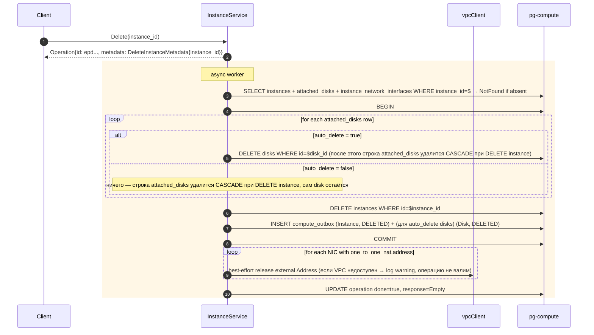
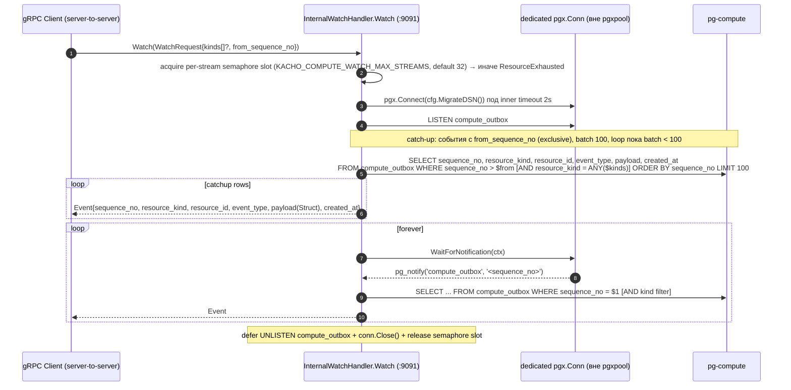

# 02 — Data Flows

Sequence-диаграммы compute-сценариев (то, что в коде / задано CLAUDE.md).
Стиль и шаблон идентичны kacho-vpc (см. `../kacho-vpc/docs/architecture/02-data-flows.md`).

## Содержание

1. [Operations LRO worker (общий шаблон)](#1-operations-lro-worker-общий-шаблон)
2. [Disk.Create](#2-diskcreate)
3. [Image.Create (source oneof resolve)](#3-imagecreate-source-oneof-resolve)
4. [Snapshot.Create (из Disk READY)](#4-snapshotcreate-из-disk-ready)
5. [Instance.Create (NIC + boot-disk validation, single TX)](#5-instancecreate-nic--boot-disk-validation-single-tx)
6. [Instance.AttachDisk / DetachDisk](#6-instanceattachdisk--detachdisk)
7. [Instance.Delete (auto_delete + NAT release)](#7-instancedelete-auto_delete--nat-release)
8. [Outbox + LISTEN/NOTIFY + InternalWatchService](#8-outbox--listennotify--internalwatchservice)

---

## 1. Operations LRO worker (общий шаблон)

Все мутации (`Create/Update/Delete/Start/Stop/Restart/Move/AttachDisk/...`)
возвращают `*operation.Operation`; реальная работа — в worker-горутине через
`operations.Run(ctx, opsRepo, opID, fn)`. Шаблон идентичен VPC
(`../kacho-vpc/internal/service/route_table.go`).

```mermaid
sequenceDiagram
  autonumber
  participant H as Handler (gRPC :9090)
  participant S as <Resource>Service
  participant Ops as corelib/operations
  participant DB as pg-compute
  participant Client

  H->>S: Create(req)
  S->>S: SYNC validate (required, NameCompute, size, mask, ...)
  S->>S: resID = ids.NewID(ids.PrefixXxx)   # epd / fd8
  S->>Ops: New(ids.PrefixOperationCompute, "Create xxx <name>", &CreateXxxMetadata{...Id: resID})
  Note right of Ops: PrefixOperationCompute == PrefixInstance == "epd"
  Ops-->>S: Operation{id: epd..., done: false}
  S->>DB: opsRepo.Create(op)
  S->>Ops: Run(ctx, opsRepo, op.ID, fn doCreate)
  S-->>H: &Operation
  H-->>Client: Operation (HTTP 200)

  par async worker
    Ops->>S: doCreate(ctx)
    S->>DB: бизнес-работа (existence-checks → BEGIN; INSERT; INSERT compute_outbox; COMMIT)
    alt success
      S-->>Ops: anypb.New(protoconv.Xxx(created))
      Ops->>DB: UPDATE operations SET done=true, response_type/response_data
    else error
      S-->>Ops: error  (через mapRepoErr → grpc-status)
      Ops->>DB: UPDATE operations SET done=true, error_code/error_message/error_details
    end
  and client polling
    Client->>H: OperationService.Get(opID)   # GET /operations/{id}
    H->>DB: SELECT * FROM operations WHERE id=$1
    H-->>Client: Operation{done?, response?, error?}
  end
```

Особенности:
- **Delete-response = Empty.** Согласно `(kacho.cloud.api.operation)`-options всех
  Delete RPC (`metadata: "DeleteXxxMetadata", response: "google.protobuf.Empty"`)
  worker возвращает `anypb.New(&emptypb.Empty{})`; metadata уже в
  `Operation.metadata`. То же для `Stop`/`Restart`/`SimulateMaintenanceEvent`
  (response `Empty`); `Start`/`AttachDisk`/`DetachDisk`/NAT/UpdateMetadata —
  response `Instance`; Disk/Image/Snapshot Create/Update/Move/Relocate — response
  соответствующего ресурса.
- Worker — на той же поде, что сервис. graceful shutdown ждёт активных
  worker'ов через `operations.Wait(30s)` в `cmd/compute/main.go` (как в VPC после
  закрытия concurrency P0 #1).
- В unit-тестах worker дожидаются детерминированно через `portmock.AwaitOpDone` /
  `AwaitAllOpsDone` (poll до `Operation.Done`, дедлайн 2s — не `time.Sleep`).

---

## 2. Disk.Create

```mermaid
sequenceDiagram
  autonumber
  participant U as Client
  participant S as DiskService
  participant RM as resource-manager (folderClient)
  participant ZR as ZoneRegistry (zones table)
  participant DTR as DiskTypeRepo (disk_types table)
  participant DB as pg-compute

  U->>S: Create(folder_id, zone_id, size, type_id?, image_id?|snapshot_id?, block_size?, ...)
  S->>S: SYNC: folder_id/zone_id/size required;<br/>NameCompute(name); validateDiskSize (Create: 4194304..28587302322176);<br/>block_size whitelist; exactly-one source; kms_key_id → blocked:kacho-kms
  S-->>U: Operation{id: epd..., metadata: CreateDiskMetadata{disk_id: epd...}}

  rect rgb(255,247,230)
  Note over S: async worker
  S->>RM: folderClient.Exists(folder_id)
  alt folder not found
    S->>DB: UPDATE operation error=NotFound "Folder with id <X> not found"
  else folder OK
    S->>ZR: zone existence (zones table)
    Note over ZR: unknown zone → InvalidArgument (паритет с VPC; probe — YC может давать NotFound "Zone <X> not found")
    S->>DTR: type_id existence (default network-ssd if empty) → unknown → NotFound "Disk type <X> not found"
    alt source = image_id
      S->>DB: SELECT images WHERE id=$image_id → NotFound if absent;<br/>size >= image.min_disk_size else InvalidArgument
    else source = snapshot_id
      S->>DB: SELECT snapshots WHERE id=$snapshot_id → NotFound;<br/>size >= snapshot.disk_size else InvalidArgument
    end
    S->>DB: BEGIN; INSERT disks (status='READY', source_*); INSERT compute_outbox (Disk, CREATED); COMMIT
    alt UNIQUE violation disks_folder_name_uniq
      DB-->>S: 23505 → mapRepoErr → ALREADY_EXISTS
      S->>DB: UPDATE operation error
    else success
      S->>DB: UPDATE operation done=true, response=protoconv.Disk(created)
    end
  end
  end
```

`Status` сразу `READY` — control-plane, реального создания тома нет.

---

## 3. Image.Create (source oneof resolve)

`oneof source` (`exactly_one`): `image_id` | `disk_id` | `snapshot_id` | `uri`.
`os_product_ids` → `blocked:kacho-marketplace`.

```mermaid
sequenceDiagram
  autonumber
  participant U as Client
  participant S as ImageService
  participant RM as folderClient
  participant DB as pg-compute

  U->>S: Create(folder_id, name?, family?, min_disk_size?, source{image_id|disk_id|snapshot_id|uri}, os?, ...)
  S->>S: SYNC: folder_id required; exactly-one source; NameCompute; family pattern;<br/>min_disk_size 4194304..4398046511104; os_product_ids → blocked
  S-->>U: Operation{id: epd..., metadata: CreateImageMetadata{image_id: fd8...}}

  rect rgb(255,247,230)
  Note over S: async worker
  S->>RM: folderClient.Exists(folder_id)
  alt source = image_id
    S->>DB: SELECT images WHERE id=$image_id → NotFound if absent; inherit os, family if not set
  else source = disk_id
    S->>DB: SELECT disks WHERE id=$disk_id → NotFound; disk должен быть READY (FailedPrecondition — text probe)
  else source = snapshot_id
    S->>DB: SELECT snapshots WHERE id=$snapshot_id → NotFound
  else source = uri
    Note over S: control-plane заглушка: download «мгновенный», storage_size = 0/synthetic
  end
  S->>DB: BEGIN; INSERT images (status='READY', source_image_id|source_disk_id|source_snapshot_id|source_uri); INSERT compute_outbox (Image, CREATED); COMMIT
  S->>DB: UPDATE operation done=true, response=protoconv.Image(created)
  end
```

`GetLatestByFamily(folder_id, family)` — `SELECT * FROM images WHERE folder_id=$1
AND family=$2 ORDER BY created_at DESC LIMIT 1` (индекс `images_family_idx`); нет
ни одного → `NotFound`.

---

## 4. Snapshot.Create (из Disk READY)

```mermaid
sequenceDiagram
  autonumber
  participant U as Client
  participant S as SnapshotService
  participant RM as folderClient
  participant DB as pg-compute

  U->>S: Create(folder_id, disk_id, name?, ...)
  S->>S: SYNC: folder_id + disk_id required; NameCompute
  S-->>U: Operation{id: epd..., metadata: CreateSnapshotMetadata{snapshot_id: fd8..., disk_id}}

  rect rgb(255,247,230)
  Note over S: async worker
  S->>RM: folderClient.Exists(folder_id)
  S->>DB: SELECT disks WHERE id=$disk_id
  alt disk not found
    S->>DB: UPDATE operation error=NotFound "Disk <X> not found"
  else disk not READY
    S->>DB: UPDATE operation error=FailedPrecondition (text probe)
  else disk READY
    S->>DB: BEGIN; INSERT snapshots (status='READY', source_disk_id=$disk_id, disk_size=disks.size, storage_size=delta); INSERT compute_outbox (Snapshot, CREATED); COMMIT
    S->>DB: UPDATE operation done=true, response=protoconv.Snapshot(created)
  end
  end
```

`source_disk_id` сохраняется (НЕ FK — disk можно удалить, снапшот останется).

---

## 5. Instance.Create (NIC + boot-disk validation, single TX)

```mermaid
sequenceDiagram
  autonumber
  participant U as Client
  participant S as InstanceService
  participant RM as folderClient
  participant ZR as ZoneRegistry
  participant VPC as vpcClient (kacho-vpc :9090)
  participant DB as pg-compute

  U->>S: Create(folder_id, zone_id, platform_id, resources_spec,<br/>boot_disk_spec{disk_id|disk_spec, auto_delete},<br/>secondary_disk_specs[≤3], network_interface_specs[≥1], metadata?, hostname?, ...)
  S->>S: SYNC: folder_id/zone_id/platform_id/resources_spec/boot_disk_spec/≥1 NIC required;<br/>NameCompute(name); per-platform resources (platforms.go: cores set, memory range/multiple, core_fraction ∈ {0,5,20,50,100}, gpus per-platform);<br/>boot/secondary: exactly-one {disk_id, disk_spec}; metadata ≤256 KiB; filesystem_specs → blocked:kacho-filesystem
  S-->>U: Operation{id: epd..., metadata: CreateInstanceMetadata{instance_id: epd...}}

  rect rgb(255,247,230)
  Note over S: async worker
  S->>RM: folderClient.Exists(folder_id) → NotFound if absent
  S->>ZR: zone existence (zones table)
  loop for each network_interface_spec
    S->>VPC: SubnetService.Get(subnet_id) → NotFound "Subnet <X> not found"
    S->>S: assert subnet.zone_id == instance.zone_id else InvalidArgument
    loop for each security_group_id
      S->>VPC: SecurityGroupService.Get(sg_id) → NotFound "Security group <X> not found"
    end
    opt one_to_one_nat.address set
      S->>VPC: AddressService.Get(address) → NotFound "Address <X> not found"
    end
  end
  alt boot_disk_spec.disk_id
    S->>DB: SELECT disks WHERE id=$disk_id → NotFound; disk READY & same zone & not attached
  else boot_disk_spec.disk_spec
    Note over S: inline-создание Disk (в той же TX ниже): source image_id/snapshot_id existence-check
  end
  S->>DB: BEGIN
  S->>DB: (если disk_spec) INSERT disks (boot, status='READY')
  S->>DB: INSERT instances (status='PROVISIONING' → конечный 'RUNNING' в той же TX; fqdn computed)
  S->>DB: INSERT instance_network_interfaces (по одной строке на NIC, idx '0','1',...)
  S->>DB: INSERT attached_disks (boot: is_boot=true; secondary: is_boot=false)
  S->>DB: INSERT compute_outbox (Instance, CREATED)
  S->>DB: COMMIT
  alt UNIQUE violation (instances_folder_name_uniq / attached_disks_boot_uniq / device_uniq) or FK violation
    DB-->>S: 23505/23503 → mapRepoErr → ALREADY_EXISTS / FailedPrecondition
    S->>DB: UPDATE operation error
  else success
    S->>DB: UPDATE operation done=true, response=protoconv.Instance(created)  # status RUNNING
    loop for each NIC address
      alt ephemeral (compute-created: internal <vmid>-nicN OR ephemeral external <vmid>-natN)
        S->>VPC: InternalAddressService.MarkAddressEphemeralInUse(address_id, "compute_instance", instance_id, instance_name) — atomically sets reserved=false, used=true + upserts referrer
      else reserved (user-provided one_to_one_nat.address_id)
        S->>VPC: InternalAddressService.SetAddressReference(address_id, "compute_instance", instance_id, instance_name) — referrer only, reserved=true intact
      end
      Note over S,VPC: best-effort (ошибка → warning, не валит инстанс)
    end
  end
  end
```

Control-plane имитация: статус переходит `PROVISIONING → RUNNING` синхронно в той
же TX (без таймеров; см. [`03-instance-lifecycle.md`](03-instance-lifecycle.md)).
После успешной вставки compute проставляет referrer (`type=compute_instance`,
`id=instance_id`, `name=instance_name`) каждому VPC `Address`-ресурсу NIC-ей.
Эфемерные адреса (которые compute создал сам через `AddressService.Create`) при
этом флипаются `reserved=true → false` и помечаются `used=true` атомарно — через
`MarkAddressEphemeralInUse`; у reserved пользовательских адресов
(`one_to_one_nat.address_id`) `reserved` остаётся `true`, добавляется только
`used_by[]`. Адреса видны в `AddressService.Get/List` с `used_by=[…]` и в
`SubnetService.ListUsedAddresses` (YC-like; см.
[`07-known-divergences.md`](07-known-divergences.md) §8).

---

## 6. Instance.AttachDisk / DetachDisk

```mermaid
sequenceDiagram
  autonumber
  participant U as Client
  participant S as InstanceService
  participant DB as pg-compute

  U->>S: AttachDisk(instance_id, attached_disk_spec{disk_id|disk_spec, mode, device_name?, auto_delete})
  S->>S: SYNC: instance_id required; exactly-one {disk_id, disk_spec}; device_name pattern
  S-->>U: Operation{id: epd..., metadata: AttachInstanceDiskMetadata{instance_id, disk_id}}

  rect rgb(255,247,230)
  Note over S: async worker
  S->>DB: SELECT instances WHERE id=$instance_id → NotFound
  S->>S: assert status ∈ {RUNNING, STOPPED} else FailedPrecondition (text probe)
  S->>DB: SELECT disks WHERE id=$disk_id → NotFound; assert status=READY & zone_id=instance.zone_id else InvalidArgument/FailedPrecondition
  S->>DB: SELECT attached_disks WHERE disk_id=$disk_id → если уже attached → FailedPrecondition (verbatim YC "The disk is being used")
  S->>DB: BEGIN; INSERT attached_disks (is_boot=false, mode, device_name, auto_delete); INSERT compute_outbox (Instance, UPDATED); COMMIT
  alt attached_disks_device_uniq violation
    DB-->>S: 23505 → InvalidArgument/AlreadyExists
  else success
    S->>DB: UPDATE operation done=true, response=protoconv.Instance(refreshed)  # status unchanged
  end
  end

  U->>S: DetachDisk(instance_id, oneof{disk_id|device_name})
  S->>S: SYNC: exactly-one of {disk_id, device_name}
  S-->>U: Operation{id: epd...}
  rect rgb(255,247,230)
  Note over S: async worker
  S->>DB: SELECT instances WHERE id=$instance_id → NotFound; status ∈ {RUNNING, STOPPED}
  S->>DB: resolve attached_disks row by disk_id / device_name → NotFound if absent; assert NOT is_boot else FailedPrecondition (boot disk нельзя detach)
  S->>DB: BEGIN; DELETE attached_disks WHERE instance_id=$ AND disk_id=$; INSERT compute_outbox (Instance, UPDATED); COMMIT
  S->>DB: UPDATE operation done=true, response=protoconv.Instance(refreshed)
  end
```

`AddOneToOneNat` / `RemoveOneToOneNat` / `UpdateNetworkInterface` устроены
аналогично: worker берёт instance + NIC по `network_interface_index`, валидирует
precondition (`status ∈ {RUNNING, STOPPED}` для NAT; `xmin` OCC для
UpdateNetworkInterface read-modify-write), обновляет `instance_network_interfaces`
+ outbox `Instance UPDATED`, status не меняется.

---

## 7. Instance.Delete (auto_delete + NAT release)



⚠️ FK `attached_disks.disk_id` RESTRICT означает: чтобы удалить
`auto_delete=false` disk вне Instance.Delete (`DiskService.Delete`), он не должен
быть в `attached_disks` → иначе `FailedPrecondition "The disk <id> is being
used"`. Hard-delete, без tombstones (паритет VPC).

---

## 8. Outbox + LISTEN/NOTIFY + InternalWatchService

Каждая успешная мутация в `service/*.go` (через worker) пишет событие в
`compute_outbox` в той же транзакции, что и domain-INSERT/UPDATE/DELETE. Триггер
`compute_outbox_notify_trg` шлёт `pg_notify('compute_outbox', sequence_no::text)`.



Структурно `internal/handler/internal_watch_handler.go` идентичен
`../kacho-vpc/internal/handler/internal_watch_handler.go`. `compute_watch_cursors`
(`subscriber_id PK, last_sequence_no`) — таблица для persistence-курсоров будущих
durable-consumer'ов (сейчас не обязательна — клиент передаёт `from_sequence_no`
сам). UI/CLI **не используют** Watch — они полят через
`OperationService.Get(id)` для in-flight операций и List 2-5 сек для общего
состояния.

---

## Где смотреть исходник (после реализации)

| Поток | Код |
|---|---|
| Operations worker | `kacho-corelib/operations/run.go`, `worker.go` |
| Disk create | `internal/service/disk.go::doCreate` |
| Image create + source resolve | `internal/service/image.go::doCreate` |
| Snapshot create | `internal/service/snapshot.go::doCreate` |
| Instance create + NIC validation | `internal/service/instance.go::doCreate` |
| Attach/Detach/NAT/UpdateNIC | `internal/service/instance.go` |
| Instance delete + auto_delete | `internal/service/instance.go::doDelete` |
| Cross-service clients | `internal/clients/resourcemanager_client.go`, `internal/clients/vpc_client.go` |
| Outbox emit | `internal/repo/*.go` (в той же TX, что domain-write) |
| Outbox + LISTEN/NOTIFY | `internal/handler/internal_watch_handler.go` |
| Platform validation | `internal/service/platforms.go` |
| Error mapping | `internal/service/maperr.go` |
